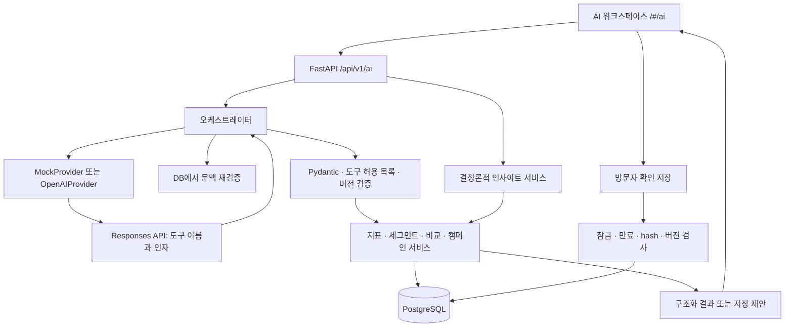
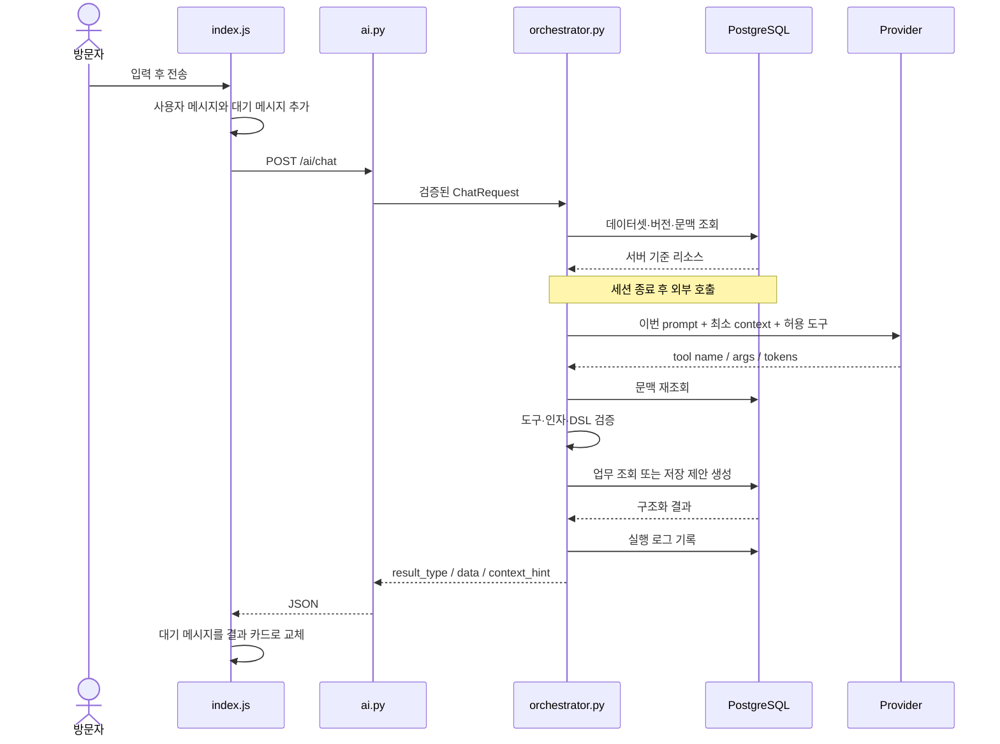
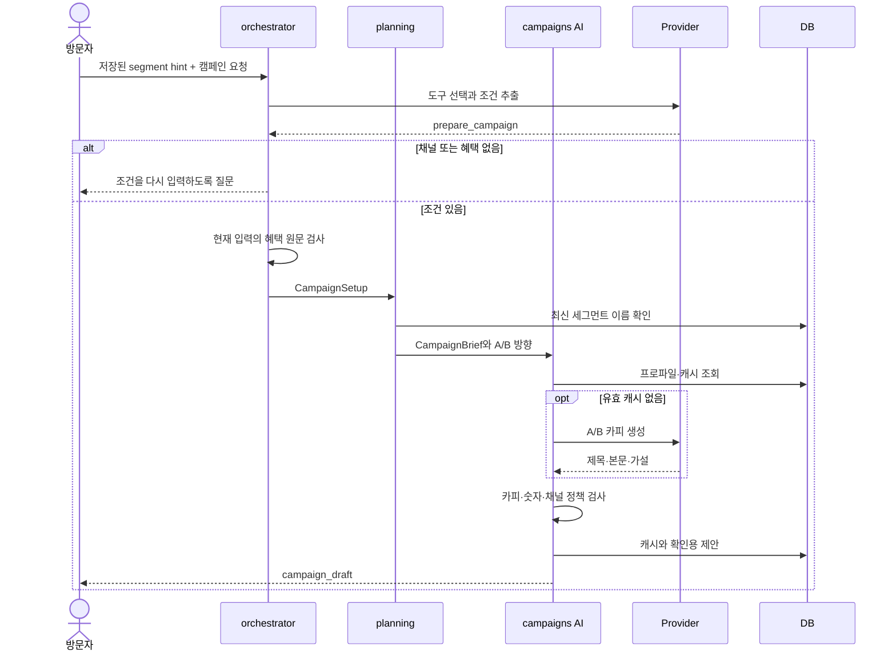

# AI 어시스턴트 구현 아키텍처와 실행 흐름

> 코드 확인 기준: 2026-09-23  
> 대상: `/#/ai` 독립 AI 워크스페이스와 이 화면이 재사용하는 AI-A~D 서비스  
> 문서 성격: 현재 구현 해설. 향후 설계안이나 API 공급자의 일반 기능 설명이 아니다.

관련 문서: [구현 결과·사용법](ai_assistant_workspace.md), [요구 명세](ai_assistant_redesign_spec.md), [단계별 실행 계획](ai_assistant_redesign_execution_plan.md), [기존 캠페인 초안 LLM 해설](campaign_draft_llm_walkthrough.md).

## 목차

1. [전체 구조와 책임 분리](#1-전체-구조와-책임-분리)
2. [파일 지도와 추천 읽기 순서](#2-파일-지도와-추천-읽기-순서)
3. [화면 진입과 인사이트](#3-화면-진입과-인사이트)
4. [대화 요청의 전체 수명](#4-대화-요청의-전체-수명)
5. [LLM provider와 도구 계약](#5-llm-provider와-도구-계약)
6. [도구별 실행 경로](#6-도구별-실행-경로)
7. [문맥 관리와 기억의 범위](#7-문맥-관리와-기억의-범위)
8. [API 요청·응답 예시](#8-api-요청응답-예시)
9. [제안·확인 저장과 DB](#9-제안확인-저장과-db)
10. [캐시·로그·식별자](#10-캐시로그식별자)
11. [프런트 렌더링·스크롤·취소](#11-프런트-렌더링스크롤취소)
12. [오류 처리와 점검 순서](#12-오류-처리와-점검-순서)
13. [검증·실행·확장 지점](#13-검증실행확장-지점)
14. [현재 제한과 설명 시 주의점](#14-현재-제한과-설명-시-주의점)
15. [질문부터 화면 결과까지 — 다양한 사용 시나리오](#15-질문부터-화면-결과까지--다양한-사용-시나리오)

## 1. 전체 구조와 책임 분리

AI 어시스턴트는 자연어를 제한된 업무 도구 호출로 바꾸는 인터페이스다. LLM이 요청을 해석하고 도구와 인자를 선택하면, 서버가 이를 검증한 뒤 기존 업무 서비스를 실행한다. 고객 수·전환율·매출은 DB 집계 결과를 화면에 직접 표시한다.

현재 구현은 Python/FastAPI·SQLAlchemy·PostgreSQL, 빌드 없는 HTML/CSS/JavaScript ES modules, HTTPX 기반 모델 호출로 구성된다. 이 경로에는 LangChain, 에이전트 프레임워크, MCP 서버, 벡터 검색, 별도 대화 저장소가 없다.



| 책임 | 수행 주체 | 구체적인 예 |
| --- | --- | --- |
| 요청 해석 | LLM 또는 정해진 모의 응답 | “전환율 높은 캠페인 비교” → `compare_campaigns` |
| 실행 가능 범위 정의 | 서버 도구 스키마 | 정렬 필드는 네 종류, 결과 최대 10개 |
| 고객 조건 검증 | Pydantic DSL | 허용 필드·연산자·값 타입 검사 |
| 지표 계산 | 업무 서비스와 DB | 고객 수, 발송 수, 전환율, 기여 매출 |
| 카피 작성 | LLM | A/B 제목·본문·가설 생성 |
| 카피 검증 | 서버 | 혜택 유지, 숫자·단위, 채널 길이와 정책 |
| 최종 저장 판단 | 방문자 | 확인 저장 버튼 |
| 일관된 저장 | DB 트랜잭션 | 업무 행·감사 기록·제안 완료를 함께 반영 |

일반 지표·비교 요청은 모델 호출 한 번 뒤 서비스 결과를 바로 보여준다. 결과를 다시 LLM에 넣어 설명문을 만드는 두 번째 요약 호출은 없다. 다만 **캠페인 준비는 첫 도구 선택 후 별도의 카피 생성 호출로 이어질 수 있다.** 따라서 “모든 사용자 요청이 반드시 LLM 한 번으로 끝난다”는 설명은 정확하지 않다.

## 2. 파일 지도와 추천 읽기 순서

### 2.1 프런트엔드

아래 경로는 저장소 루트 기준이다. AI 기능 파일은 [`frontend/src/features/ai/`](../frontend/src/features/ai/)에 모여 있다.

| 파일 | 핵심 함수·상태 | 역할 |
| --- | --- | --- |
| [frontend/index.html](../frontend/index.html) | 공통 문서·메뉴·필터·본문 | 실제 AI 메시지 마크업은 JS가 생성 |
| [src/app/main.js](../frontend/src/app/main.js) | `render()` | 데이터셋 로드, 페이지 신호 생성, `renderAI()` 호출 |
| [src/app/router.js](../frontend/src/app/router.js) | `parseRoute()`, `routeHash()`, `apiPeriod()` | hash URL, 리소스·기간 보존, 한국 날짜→UTC |
| [src/app/store.js](../frontend/src/app/store.js) | `get/set/subscribe` | 공통 route·선택 데이터셋·로딩 상태 |
| [ai/index.js](../frontend/src/features/ai/index.js) | `memory`, `renderAI()`, `submit()`, `confirm()`, `draw()` | 대화 상태와 전체 화면 조립·요청 수명 |
| [ai/insights.js](../frontend/src/features/ai/insights.js) | `insights()` | 인사이트 조회, 재시도, 입력·이동 CTA |
| [ai/examples.js](../frontend/src/features/ai/examples.js) | `examples()` | 데이터 조회·세그먼트·비교 예시 그룹 |
| [ai/input.js](../frontend/src/features/ai/input.js) | `chatInput()` | 입력창, 문맥 칩, 전송, 키보드·IME |
| [ai/conversation.js](../frontend/src/features/ai/conversation.js) | `messageNode()` | 말풍선, 지표, 미리보기, 캠페인 제안, 저장 상태 |
| [ai/comparison.js](../frontend/src/features/ai/comparison.js) | `comparison()` | 비교 표, 숫자·null 표시, 결과 화면 링크 |
| [ai/performance.js](../frontend/src/features/ai/performance.js) | `performanceAssistant()` | Campaigns·Experiments에서 사용하는 기존 AI-D 화면 |
| [segments/preview.js](../frontend/src/features/segments/preview.js) | `renderPreview()` | 세그먼트 화면과 공유하는 대상 프로파일 UI |
| [src/api/client.js](../frontend/src/api/client.js) | `request()`, `ApiError` | same-origin fetch, JSON 검증, 오류·취소 전달 |
| [src/components/dom.js](../frontend/src/components/dom.js) | `el()`, `button()`, `errorMessage()` | `textContent` 기반 안전한 DOM 생성 |
| [styles/components.css](../frontend/styles/components.css) | `.ai-workspace-redesign` 등 | 카드·대화·문맥·비교·모바일 스타일 |
| [styles/layout.css](../frontend/styles/layout.css), [tokens.css](../frontend/styles/tokens.css) | 공통 레이아웃·변수 | 사이드바·필터·색상·글꼴 |

**읽기 순서:** `main.js` → `ai/index.js` → `input.js`/`conversation.js` → `client.js`. 화면 상태의 실제 소유자는 `conversation.js`가 아니라 `index.js`의 모듈 변수 `memory`다.

### 2.2 API·AI 계층

| 파일 | 핵심 역할 |
| --- | --- |
| [app/api/routes/ai.py](../app/api/routes/ai.py) | API 진입점, 입력 모델, DB 유무 확인, request ID 전달 |
| [app/ai/schemas.py](../app/ai/schemas.py) | `ChatRequest`, `Confirmation`, `CampaignSetup`, `CampaignBrief` |
| [app/ai/workspace_schemas.py](../app/ai/workspace_schemas.py) | typed 문맥 union, 비교 필터·상한, 인사이트 응답 |
| [app/ai/orchestrator.py](../app/ai/orchestrator.py) | 일반 채팅 라우팅, 인자 검증, 기존 서비스 실행, 확인 저장 |
| [app/ai/tools.py](../app/ai/tools.py) | 모델에 제공할 function 도구 JSON Schema |
| [app/ai/provider.py](../app/ai/provider.py) | 모의 응답, 실제 HTTP 호출, instructions, 입력 보호, timeout·재시도 |
| [app/ai/planning.py](../app/ai/planning.py) | 선택한 세그먼트·설정을 CampaignBrief로 변환 |
| [app/ai/campaigns.py](../app/ai/campaigns.py) | A/B 생성·검증·캐시·제안·확인 적용 |
| [app/ai/performance.py](../app/ai/performance.py) | 기존 AI-D 근거 기반 분석·후속 초안 |
| [app/core/config.py](../app/core/config.py) | AI 모드·모델·키·시간·출력 제한 설정 |
| [app/core/errors.py](../app/core/errors.py) | 공통 오류 응답, 요청마다 request ID 생성 |

### 2.3 업무·데이터 계층

| 파일 | 역할 |
| --- | --- |
| [app/services/insights.py](../app/services/insights.py) | 초기 카드 세 종류를 LLM 없이 생성 |
| [app/services/ai_context.py](../app/services/ai_context.py) | 문맥 리소스 재조회, 서버 라벨 재생성 |
| [app/services/analytics.py](../app/services/analytics.py) | Overview 지표·스냅샷·데이터 버전 검사 |
| [app/services/segments.py](../app/services/segments.py) | 미리보기·프로파일·세그먼트 저장·revision |
| [app/domain/segments/dsl.py](../app/domain/segments/dsl.py), [compiler.py](../app/domain/segments/compiler.py) | 구조화 조건 검증과 쿼리 컴파일 |
| [app/domain/segments/fields.py](../app/domain/segments/fields.py) | 조건 필드·연산자 정의 |
| [app/services/performance.py](../app/services/performance.py) | 개별 성과 집계와 `compare_campaigns()` |
| [app/services/campaigns.py](../app/services/campaigns.py) | 캠페인 저장·수정·버전·감사 기록 |
| [app/services/policies.py](../app/services/policies.py) | 기존 동의·연락처·중복·피로도 검수 |
| [app/repositories/](../app/repositories/) | SQL 조회·영속 처리, 데이터 버전·리소스 조회 |
| [app/models/ai.py](../app/models/ai.py) | AI 제안·실행 로그·카피 캐시 모델 |
| [alembic/versions/008_ai_conversation.py](../alembic/versions/008_ai_conversation.py) | 기존 로그에 nullable conversation ID와 인덱스 추가 |

## 3. 화면 진입과 인사이트

### 3.1 화면을 여는 순서

1. `router.js`가 `/#/ai?dataset=...&from=...&to=...`를 해석한다.
2. `main.js`는 이전 페이지의 AbortController를 취소하고 새 signal을 만든다.
3. 데이터셋 목록과 선택 데이터셋을 확인한 뒤 `renderAI(content, signal)`을 호출한다.
4. AI 화면은 메모리 상태를 새로 만들거나 같은 범위의 기존 대화를 복원한다.
5. `/ai/status`로 모의/실제 표시와 설정 유무를 확인한다.
6. `insights.js`는 `/ai/insights`를 조회하고 `examples.js`는 정해진 예시를 렌더링한다.
7. 사용자 메시지가 하나라도 있으면 초기 인사이트·예시 대신 대화만 표시한다.

현재 `welcome` 노드는 `renderAI()`마다 구성되므로, 대화 복원 시에도 인사이트 요청 자체는 발생할 수 있다. 다만 대화가 이미 시작되었다면 welcome 노드를 메시지 영역에 붙이지 않는다.

`/ai/status`의 `available`은 mock이거나 서버 키가 설정되어 있는지 확인하는 값이다. 실제 모델 접속 성공·계정 사용 가능 여부까지 검사하는 health check는 아니다.

### 3.2 인사이트 생성 근거

| 카드 | 계산 | 표시·동작 |
| --- | --- | --- |
| 활성 고객 비율 | `analytics.overview()`의 active/total | 활성 고객 수·전체 대비 비율, 질문 자동 채움 |
| 캠페인 대상 후보 | 경과일 ≥60 AND 누적 구매액 ≥300000 | 대상 수, 세그먼트 초안 질문 자동 채움 |
| 최근 완료 캠페인 | 선택 기간에 SENT가 있는 완료 캠페인 중 완료 run 시각 순 | 기존 성과 집계, 해당 캠페인의 AI 분석 탭 이동 |

활성 고객은 값이 있고 전체 고객 수가 양수일 때 표시한다. 후보 세그먼트 카드는 실제 결과가 0명이어도 표시한다. 최근 완료 캠페인이 없으면 그 카드만 생략한다. 모든 빈 값을 임의의 0으로 채우는 방식은 아니다.

후보 조건에는 이메일 동의가 없다. 따라서 후보 수는 **발송 가능한 고객 수가 아니라 정책 검수 전 대상 수**다. 이메일 동의를 포함하는 별도의 세그먼트 예시 버튼과 구분해야 한다.

Overview의 repeatable-read 조회 뒤 `session.rollback()`으로 읽기 트랜잭션을 끝내고, preview에는 앞서 읽은 `data_version`을 전달한다. 중간 데이터 변경을 감지하면서 기존 preview의 데이터셋 잠금 경로를 재사용한다. 세 카드 전부를 하나의 장기 repeatable-read 트랜잭션에서 계산한다는 뜻은 아니다.

CTA는 두 종류다. `prefill_prompt`는 입력만 채우고 자동 전송하지 않는다. `action: navigate`는 campaign UUID를 확인한 후 프런트가 내부 URL을 만든다. 서버가 임의 외부 URL을 보내 이동시키는 형태가 아니다.

## 4. 대화 요청의 전체 수명



`submit()`은 전송 중 입력과 버튼을 잠그고, 사용자 메시지와 대기 메시지를 즉시 배열에 추가한다. 응답이 오면 같은 대기 메시지 객체에 `response`를 넣는다. 이전 대화 전체를 응답 하나로 덮어쓰지 않는다.

서버의 일반 채팅 경로는 다음 순서로 작동한다.

1. 데이터셋 접근 가능 여부와 현재 데이터 버전을 읽는다.
2. `context_hint`를 DB에서 다시 조회하고 최대 100개의 현재 세그먼트 이름/revision 목록을 준비한다.
3. 입력과 세그먼트 이름에 `safe_prompt()`를 적용한다.
4. 문맥이 처음부터 잘못되었다면 모델을 호출하지 않고 clarification을 만든다.
5. provider가 반환한 도구 이름과 인자 키 집합을 검사한다. 불필요한 추가 인자도 거절한다.
6. 모델 대기 중 문맥이 변경되었는지 다시 조회한다.
7. 도구에 맞는 업무 서비스를 실행한다. 일반 비지표 분기는 데이터셋 잠금과 데이터 버전 비교를 수행하고, 지표 분기는 analytics의 스냅샷·버전 검사를 이용한다.
8. 실행 로그와 응답을 만든다.

`analysis_campaign_id`, `campaign_brief`, `campaign_id`가 있는 기존 요청은 일반 도구 선택보다 먼저 AI-D 또는 캠페인 제안 서비스로 분기한다. 새 워크스페이스는 이 이전 선택기용 필드를 보내지 않는다.

## 5. LLM provider와 도구 계약

### 5.1 실제 호출

`OpenAIProvider.plan(prompt, context)`는 HTTPX로 Responses 엔드포인트에 요청한다. 현재 코드가 설정하는 주요 값은 다음과 같다.

| 설정 | 구현 |
| --- | --- |
| 모델 | 서버 `AI_MODEL`, 코드 기본값 `gpt-4.1-mini` |
| 프롬프트 | `input`에 이번 사용자 요청, `instructions`에 업무 규칙·도구 사용 지침·컨텍스트 |
| 저장 옵션 | `store: false` |
| 도구 선택 | `tool_choice: required` |
| 병렬 도구 | `parallel_tool_calls: false` |
| 출력 | 기본 2,000토큰, 설정 범위 256~4,000 |
| 시간 | 기본 20초, 설정 상한 60초 |
| 응답 크기 | 100,000바이트 초과 거절 |
| 재시도 | 429 또는 5xx에 남은 시간 예산 안에서 한 번 |
| 성공 형식 | status completed, function_call 정확히 한 개 |

provider 반환값은 `(name, args, total_tokens)`다. 모델의 임의 문장을 그대로 실행하는 대신 서버 분기표가 이 세 값을 소비한다. HTTP 응답을 내부적으로 청크 단위로 읽더라도 브라우저로 토큰을 실시간 전달하는 스트리밍 채팅은 아니다.

이 문서는 현재 저장소의 요청 설정을 설명한다. `store=false`만으로 외부 공급자의 모든 보존 정책이나 개인정보 처리를 보장한다고 해석하지 않는다.

### 5.2 도구 목록

| 도구 | 주요 인자 | 실행 결과 | DB 영향 |
| --- | --- | --- | --- |
| `get_metric` | metric | `metric` | 집계 조회, 실행 로그 |
| `preview_segment` | condition_json | `segment_preview` | preview 조회, 실행 로그 |
| `create_segment_draft` | name, condition_json | `segment_preview` + proposal_id | 저장 제안과 실행 로그; 실제 세그먼트는 아직 없음 |
| `clarify` | question | `clarification` | 실행 로그 |
| `compare_campaigns` | filter, sort, order, limit | `campaign_comparison` | 성과 조회, 실행 로그 |
| `prepare_campaign` | channel, benefit, objective, brand_tone | 질문 또는 `campaign_draft` | 카피 캐시·저장 제안·실행 로그 |
| `validate_campaign` | 없음 | 기존 `campaign_validation` | 검수 기록과 감사·실행 로그; 새 AI 페이지 선택기 없음 |

기본 도구는 `TOOLS + COMPARE_TOOLS`다. 서버가 확인한 segment 문맥이 있을 때 `WORKFLOW_TOOLS`의 `prepare_campaign`을 추가한다. 기존 검수·카피·성과 전용 문맥에서는 해당 업무의 도구 집합으로 바꾼다.

`tools.py`의 `tool()`은 `strict: true`, 전체 속성 required, `additionalProperties: false`를 만든다. 비교 도구의 중첩 filter에도 같은 제한을 둔다. 그 뒤에도 Pydantic과 오케스트레이터가 다시 검사하므로 strict 출력 설정만 신뢰하지 않는다.

### 5.3 모의 모드

`MockProvider`는 자연어 이해 모델이 아니다. 화면 예시와 일부 정해진 후속 문장을 정확히 비교해 고정 도구 응답을 반환한다. 토큰 수는 0이며 화면은 모의 응답으로 표시한다. 임의 요청에는 지원 범위를 설명하는 clarification을 반환한다.

따라서 mock에서 자유 문장을 해석하지 못하는 것과 live provider의 실패는 다른 문제다.

## 6. 도구별 실행 경로

### 6.1 지표 조회

`get_metric` → 허용 metric 검사 → `analytics.overview()` → 요청한 metric 하나만 응답.

허용 지표는 전체·활성·신규·휴면 고객, 구매 전환율, 재구매율이다. 모델은 지표를 고를 뿐 숫자는 생성하지 않는다. `conversation.js`는 `value`와 `unit`을 읽고, null은 “집계할 데이터가 없습니다”로 표시한다.

현재 지표는 선택 데이터셋 전체 기준이다. 문맥 칩에 세그먼트가 있다고 해서 `get_metric`이 자동으로 그 세그먼트 내부 지표를 계산하지 않는다.

### 6.2 세그먼트 조회와 저장 제안

```text
자연어 → condition_json 문자열
       → json.loads
       → PreviewRequest / DSL 검증
       → segments.preview
       → 실제 고객 수·프로파일
       → 저장 요청이면 SegmentWrite 정규화
       → AIActionProposal 생성
       → 방문자 확인 후 segments.save
```

DSL은 허용 필드와 비교 연산자로 구성되는 JSON 조건이다. 금액 문자열·boolean·숫자 타입을 검증한 후 서버 컴파일러가 쿼리를 만든다. 모델이 SQL을 직접 제출하는 도구는 없다. `condition_json` 문자열은 16,000자 이하로 제한한다.

조회만 요청하면 저장 버튼이 없다. 저장 초안을 요청하면 실제 세그먼트 대신 정규화 payload, SHA-256 hash, 30분 만료의 제안을 저장한다. 저장 성공 이후에만 segment ID/revision 기반 문맥 칩이 생긴다.

### 6.3 저장된 세그먼트에서 캠페인으로 연결



`prepare_campaign`에는 세그먼트 ID 인자가 없다. 서버가 확인한 hint의 revision을 사용하므로 모델이 임의 대상을 바꿔 끼우지 못한다. 혜택은 공백을 제거한 문자열이 이번 prompt 안에 있는지도 검사한다. 채널·혜택이 없으면 자동으로 지어내지 않는다.

`CampaignSetup`의 기본값은 재구매 유도, 다정하고 편안한 말투, 전환율 목표 5.00, A안 혜택 강조/B안 관계 강조다. `planning.plan()`은 세그먼트 이름과 목표로 캠페인 이름을 구성하고, 기존 `campaigns.propose()`를 호출한다. A/B 비율은 50:50이다.

카피 생성에는 최소 집단 기준을 적용한 프로파일을 사용한다. `validate_generated()`는 A/B 두 안, 혜택 원문 정규화 포함 여부, 허용되지 않은 숫자·단위, 채널 길이·일반 텍스트 규칙을 확인한다. 출력 검증 실패 시 사유를 전달해 한 번 재생성할 수 있다. 모든 비수치 사실·문장의 진실성을 자동 판별한다는 뜻은 아니다.

워크스페이스에서 초안을 제안받아도 업무 캠페인은 생성되지 않는다. 별도 확인 저장으로 DRAFT를 만든 뒤 Campaigns에서 검수·승인한다. 기존 Campaigns 사이드바는 폼 자동 채움과 일반 저장을 사용하므로, **공유 생성 서비스와 최종 저장 UI 경로를 구분해야 한다.**

### 6.4 완료 캠페인 비교

`compare_campaigns()`는 다음 조건을 순서대로 적용한다.

1. 같은 dataset, COMPLETED, `archived_at IS NULL`.
2. 선택 채널 또는 ANY.
3. 필요하면 유효한 segment revision.
4. 문맥이 campaign_list면 해당 ID 집합, segment면 해당 revision으로 범위 제한.
5. 선택 발송 기간 `[from, to)` 안에 SENT 이력이 있는 캠페인만 선택.
6. 후보가 100개를 넘으면 범위를 줄이라는 오류. 100개 일부를 임의의 전체 순위처럼 반환하지 않음.
7. 같은 observation cutoff로 기존 `campaign_performance()`를 각각 계산.
8. 실제 숫자로 정렬하고 최대 10개 반환. null은 오름/내림차순 모두 뒤에 배치.

발송 기간은 완료 시각 필터와 다르다. `completed_at`은 완료 run의 `finished_at` 최댓값을 응답용으로 붙이는 필드다. 성과에는 기존 서비스의 발송 코호트·관측·매출 귀속 기준을 그대로 사용한다.

비율의 `value`는 이미 퍼센트다. `3.27`을 프런트에서 `327%`로 다시 확대하지 않는다. 매출은 정밀도를 유지하는 문자열이며 서버 정렬은 Decimal을 사용한다.

결과에는 campaign_id, name, channel, sent_count, conversion_rate, click_rate, revenue, completed_at만 담는다. 서로 다른 대상·혜택의 관측 성과 순위이며 인과적인 우열이나 A/B 통계 승자를 판정하는 도구는 아니다.

## 7. 문맥 관리와 기억의 범위

### 7.1 세 종류의 상태를 분리한다

| 상태 | 위치 | 목적 | 서버로 전달 |
| --- | --- | --- | --- |
| messages·입력·저장 상태 | 브라우저 모듈 메모리 | 대화 화면 복원 | 전체 배열은 보내지 않음 |
| conversation_id | 브라우저 생성 UUID, 실행 로그 | 여러 요청의 추적 | 요청마다 전달 |
| context_hint | 브라우저 보관, 서버 재검증 | 다음 업무의 대상 참조 | 다음 요청에 전달 |

conversation ID는 대화 내용을 검색하는 키나 인증 토큰이 아니다. 서버가 이 ID로 과거 prompt를 불러와 모델에 전달하지 않는다.

### 7.2 문맥 형식

```json
{
  "kind": "segment",
  "id": "22222222-2222-4222-8222-222222222222",
  "revision_id": "33333333-3333-4333-8333-333333333333",
  "name": "휴면 VIP",
  "label": "휴면 VIP 세그먼트 기준으로"
}
```

```json
{
  "kind": "campaign_list",
  "campaign_ids": ["44444444-4444-4444-8444-444444444444"],
  "label": "위 1개 캠페인 기준으로"
}
```

`kind`를 discriminator로 쓰는 Pydantic union이며 추가 필드를 금지한다. 캠페인 목록은 1~10개다.

서버의 `resolve_hint()`는 다음을 검사한다.

- segment: dataset, segment ID, revision ID, 미보관, revision.version과 현재 segment.version 일치.
- campaign_list: 중복 ID 없음, 같은 dataset의 미보관 COMPLETED 캠페인이 모두 존재함.
- 이름·라벨: 클라이언트 값을 실행 근거로 사용하지 않고 DB로 다시 구성함.
- 모델 호출 후: 다시 해석한 hint가 처음과 다르면 clarification으로 전환하고 hint를 해제함.

캠페인 목록 문맥은 ID 순서를 보존하되 성과 스냅샷을 고정하지 않는다. 후속 비교는 현재 서비스 결과를 다시 계산한다. 반대로 segment 문맥은 현재 revision과 맞아야 하므로 세그먼트 편집 후 기존 칩으로 계속 실행하려 하면 재선택을 요구한다.

### 7.3 상태가 유지·초기화되는 때

| 행동 | 결과 |
| --- | --- |
| 같은 dataset·기간에서 다른 화면 방문 후 돌아옴 | 대화·입력·hint 복원 |
| dataset 또는 from/to 변경 | 대화·hint·conversation ID 초기화 |
| 문맥 제거 | hint만 제거, 대화는 유지 |
| 새 대화 | messages·hint·입력 초기화, 새 UUID |
| 새로고침 | 모듈 메모리 소멸, 복원하지 않음 |
| 다른 브라우저 탭 | 별도의 메모리 상태 |

따라서 “아까 말한 혜택 그대로”라는 자유 텍스트 기억을 기대하면 안 된다. 현재는 저장된 리소스 참조를 잇는 방식이다. 채널·혜택 보충 요청에는 필요한 값을 다시 입력해야 한다.

## 8. API 요청·응답 예시

다음 UUID와 수치는 구조 설명용이다. 실제 리소스 식별자나 고정된 집계 결과가 아니다.

### 8.1 채팅 요청

```http
POST /api/v1/ai/chat
Content-Type: application/json
```

```json
{
  "dataset_id": "11111111-1111-4111-8111-111111111111",
  "prompt": "선택 기간에 발송된 완료 캠페인을 전환율 높은 순으로 비교해줘",
  "from": "2026-08-21T15:00:00.000Z",
  "to": "2026-09-20T15:00:00.000Z",
  "reference_at": "2026-09-20T15:00:00.000Z",
  "conversation_id": "55555555-5555-4555-8555-555555555555"
}
```

한국 날짜 `2026-08-22 ~ 2026-09-20`은 시작일 자정부터 종료일 다음 날 자정 직전까지의 UTC 구간으로 변환한다. 현재 AI 화면의 `reference_at`은 이 구간의 `to`다. 데이터셋의 reference_at 필드를 덮어쓰지 않는다.

### 8.2 모델이 선택하는 비교 인자

```json
{
  "filter": {
    "status": "COMPLETED",
    "channel": "ANY",
    "segment_revision_id": "",
    "from": "",
    "to": ""
  },
  "sort": "conversion_rate",
  "order": "desc",
  "limit": 10
}
```

빈 기간은 화면 기간을 사용한다. 명시 기간은 시작·종료를 함께 주고 시간대가 있어야 한다. 비교 필터의 `segment_revision_id`는 UUID 문자열 또는 빈 문자열이다. `limit`은 bool을 포함한 다른 타입을 허용하지 않는 1~10 정수다.

### 8.3 비교 응답의 핵심 구조

```json
{
  "message": "선택한 발송 기간의 완료 캠페인을 비교했습니다.",
  "result_type": "campaign_comparison",
  "mode": "live",
  "dataset_id": "11111111-1111-4111-8111-111111111111",
  "data": {
    "campaigns": [{
      "campaign_id": "44444444-4444-4444-8444-444444444444",
      "name": "휴면 VIP 재활성화",
      "channel": "EMAIL",
      "sent_count": 700,
      "conversion_rate": 3.27,
      "click_rate": 25.0,
      "revenue": "1200000.00",
      "completed_at": "2026-09-20T10:00:00Z"
    }],
    "total_matched": 1,
    "from": "2026-08-21T15:00:00Z",
    "to": "2026-09-20T15:00:00Z",
    "reference_at": "2026-09-23T00:00:00Z",
    "sort": "conversion_rate",
    "order": "desc"
  },
  "context_hint": {
    "kind": "campaign_list",
    "campaign_ids": ["44444444-4444-4444-8444-444444444444"],
    "label": "위 1개 캠페인 기준으로"
  }
}
```

위 예시는 공통 request_id·conversation_id·data_version·최상위 reference_at 일부를 생략했다. 비교 `data.reference_at`은 실제 성과 관측 cutoff이며, 요청 기준 시점과 구분한다. 새 화면이 받는 result_type은 metric, segment_preview, clarification, campaign_comparison, campaign_draft 다섯 종류다.

### 8.4 확인 저장

```http
POST /api/v1/ai/actions/{proposal_id}/confirm
Content-Type: application/json
```

```json
{"dataset_id": "11111111-1111-4111-8111-111111111111"}
```

브라우저는 확인 시 조건·카피 payload를 다시 보내지 않는다. 서버에 보관된 제안이 저장 대상이다. 세그먼트 저장 응답에는 실제 리소스 정보와 context_hint가 함께 들어온다.

### 8.5 유지되는 기존 API

| API | 역할 | 새 워크스페이스와의 관계 |
| --- | --- | --- |
| `GET /ai/status` | 모드·설정 여부 | 직접 호출 |
| `GET /ai/insights` | 진입 집계 | 직접 호출 |
| `POST /ai/chat` | 업무 도구 선택 | 직접 호출 |
| `POST /ai/actions/{id}/confirm` | 제안 확인 저장 | 직접 호출 |
| `POST /ai/campaign-plan` | 전체 캠페인 설정·카피 | Campaigns의 기존 경로; 채팅은 내부 서비스를 재사용 |
| `POST /ai/campaign-draft` | 주어진 brief의 생성 | 호환 API 유지 |
| `POST /ai/copy-variants` | 기존 캠페인 카피 제안 | 호환 API 유지 |
| `POST /ai/actions/{id}/revise` | 편집한 문안으로 새 제안 | 기존 API 유지, 새 채팅 카드에 직접 편집 UI는 없음 |
| `POST /ai/performance-analysis` | 개별 성과 분석 | Campaigns·Experiments의 AI 분석 화면 |

## 9. 제안·확인 저장과 DB

### 9.1 제안과 업무 리소스를 분리

`AIActionProposal`은 아직 확정되지 않은 내용을 저장한다. 제안 행을 만든 것을 세그먼트·캠페인 업무 저장과 동일하게 취급하면 안 된다.

| 테이블 | 주요 필드 | 의미 |
| --- | --- | --- |
| `ai_action_proposals` | dataset_id, action_type, payload, payload_hash | 서버가 보관하는 적용 대상 |
| 같은 테이블 | expires_at, confirmed_at | 30분 만료와 확인 완료 |
| 같은 테이블 | segment_id, campaign_id | 완료 후 실제 리소스 연결 |
| 같은 테이블 | data_version, policy_version | 캠페인 제안의 변경 감지 |
| `segments`, `segment_revisions` | 조건·revision·생성 출처 | 실제 저장된 세그먼트 |
| `campaigns`, 관련 variants | DRAFT와 A/B 문안 | 실제 저장된 캠페인 |
| `audit_logs` | 변경 주체·대상·행위 | 업무 변경 이력 |

세그먼트 제안의 데이터 버전은 SegmentWrite payload에 들어 있다. 모든 action_type이 별도 data_version 컬럼만 검사하는 동일한 구현은 아니다.

### 9.2 확인 트랜잭션

1. `session.begin()`으로 트랜잭션 시작.
2. 데이터셋 잠금.
3. 같은 dataset의 proposal 행을 `FOR UPDATE`로 잠금.
4. 이미 confirmed이면 새로 생성하지 않고 연결된 리소스 상세 반환.
5. 미확인 제안의 expires_at·payload hash·payload dataset 검사.
6. action_type에 맞는 기존 저장 서비스 실행.
7. 실제 리소스 ID와 confirmed_at 기록.
8. 업무 저장·감사 기록·제안 완료를 함께 commit.

hash는 정렬된 키와 고정 separators로 직렬화한 payload의 SHA-256이다. 비밀키 서명이나 사용자 인증 수단이 아니라 저장된 제안의 변경 감지용이다.

캠페인 적용은 `campaigns.apply()`가 데이터 버전·코드의 CURRENT_VERSION 정책 기준을 확인하고 일반 저장 서비스를 호출한다. 기존 카피 변경이면 현재 캠페인의 version/DRAFT 검증도 서비스 경로에 포함된다. Settings의 모든 정책 판정을 생성 단계에서 끝낸다는 의미는 아니며 발송 전 검수·승인은 별도다.

중복 클릭은 UI와 서버 양쪽에서 처리한다. UI는 busy/saving/saved로 잠그고, 서버는 행 잠금·confirmed_at으로 같은 제안의 중복 생성을 막는다. 브라우저 요청이 중단되더라도 서버 commit을 되돌린다고 보장하지 않는다. 따라서 저장 결과가 불명확할 때 같은 proposal을 재확인하는 것이 중요하다.

## 10. 캐시·로그·식별자

### 10.1 카피 캐시

`AICopyCache`는 대화 기록 캐시가 아니다. 같은 캠페인 생성 조건에 대해 검증된 A/B 문안을 재사용한다.

캐시 키에는 dataset·데이터 버전·segment revision, 생성 context, 요청 prompt, 설정, provider/model/구현 클래스, prompt version, 정책 version, 출력 토큰 한도가 포함된다. prompt 원문은 키 계산 입력이지만 캐시 행에 원문 필드로 저장하지 않는다. 캐시에는 hash 키와 생성 문안이 보관된다.

캐시 적중 시에도 출력 검증을 다시 수행하고 **별도의 확인 제안**을 만든다. 동일 카피 재사용과 동일 제안 확인의 멱등성은 서로 다른 기능이다. 동시에 캐시가 비어 있던 요청은 데이터셋 잠금 아래에서 먼저 게시된 유효 결과를 다시 확인한다.

현재 캐시에 시간 기반 TTL이 구현되어 있다는 가정은 하지 않는다. 주로 키의 버전·입력 차이로 무효화하며 보관·정리 정책은 별도 확장 영역이다.

### 10.2 식별자 구분

| 식별자 | 생성·위치 | 용도 |
| --- | --- | --- |
| request_id | 서버 요청 미들웨어 | 개별 HTTP 실행 추적·오류 표시 |
| conversation_id | 브라우저 `crypto.randomUUID()` | 같은 대화 범위의 AI 실행 로그 묶음 |
| proposal_id | DB | 확인할 하나의 제안 식별 |
| segment ID/revision ID | DB | 저장된 대상과 고정 조건 버전 |
| campaign ID | DB | 실제 캠페인 조회·편집·결과 이동 |

### 10.3 실행 로그와 감사 로그

`AIExecutionLog`에는 dataset/request/conversation ID, actor_type, provider, model, prompt_version, status, tool_name, elapsed_ms, total_tokens를 기록한다. 프롬프트·대화 전문·모델 오류 원문을 기록하는 필드는 추가하지 않았다.

AI 실행 로그는 호출 결과·비용·시간 추적용이고, `audit_logs`는 실제 업무 변경의 이력이다. 캠페인 후속 생성은 바깥 `prepare_campaign` 실행과 안쪽 카피 생성 실행이 각각 로그를 남길 수 있으므로 HTTP 요청 수와 AI 로그 행 수가 항상 1:1은 아니다.

로그 기본 주체 값만 보고 고객을 승인한 것으로 해석하면 안 된다. 실제 승인 여부는 캠페인 승인 서비스·테이블의 상태와 방문자 결정으로 판단한다.

## 11. 프런트 렌더링·스크롤·취소

### 11.1 메시지 객체

```javascript
// 역할별로 일부 필드는 존재하지 않을 수 있다.
{
  role: 'assistant',
  content: '응답을 준비하고 있습니다…',
  prompt: '이번 요청',
  pending: true,
  at: 'ISO 시각',
  response: undefined,
  saving: false,
  saved: undefined,
  notice: '',
  error: false
}
```

`draw()`는 messages 배열을 순회해 DOM을 다시 만든다. 현재 구현은 토큰 스트리밍이나 가상 리스트, 마지막 메시지만 갱신하는 방식은 아니다. 결과 유형별 렌더링은 `messageNode()`가 맡는다.

| result_type | 렌더링 |
| --- | --- |
| metric | 한 지표의 라벨·값 |
| segment_preview | 공유 renderPreview + 필요 시 저장 버튼 |
| clarification | 서버 질문 문장 |
| campaign_comparison | 가로 스크롤 가능한 표·링크 |
| campaign_draft | 이름·혜택·목표·A/B 제안과 저장 버튼 |

### 11.2 스크롤·접근성

- 전체 화면은 세로 flex로 헤더·메시지 영역·composer를 나눈다.
- 메시지 목록만 `overflow-y: auto`다. 모바일도 입력창을 viewport 안에 두도록 CSS를 보정했다.
- 최초 진입은 scrollTop 0으로 인사이트부터 보여준다.
- 새 사용자 전송은 하단으로 이동한다. 일반 redraw는 하단에서 100px 이내인지 보고 자동 이동을 결정한다.
- 사용자 메시지는 우측, AI 메시지는 좌측이며 sr-only 역할 라벨도 있다.
- 메시지 목록은 `role=log`, `aria-live=polite`다.
- 입력은 label과 연결하고 Enter 전송·Shift+Enter 줄바꿈을 제공한다.
- composition 상태, isComposing, keyCode 229로 한글 입력 확정 Enter가 전송되지 않도록 한다.

### 11.3 취소와 복구

페이지 signal은 fetch와 버튼 이벤트 수명에 사용한다. 화면 이동·기간 변경 시 main.js가 이를 abort하고, 뒤늦은 응답은 signal 검사로 반영하지 않는다. 미완료 메시지는 중단 안내로 바뀌며 입력 prompt를 복구한다.

저장 요청 중 이탈하면 “저장 결과를 다시 확인”하는 메시지를 남긴다. 서버 작업이 끝났는지는 같은 proposal 확인으로 복구한다. AbortController는 브라우저 요청·화면 반영을 중단하는 장치이며 외부 LLM 작업이나 이미 진행된 DB 트랜잭션을 반드시 취소하는 장치는 아니다.

## 12. 오류 처리와 점검 순서

| 증상·코드 | 주요 확인 파일 | 의미·다음 확인 |
| --- | --- | --- |
| 인사이트만 실패 | insights.js, services/insights.py | 조회 오류를 표시하되 수동 채팅은 계속 사용 가능 |
| AI_NOT_CONFIGURED | config.py, provider.py | 키 설정 유무 확인; 키 자체는 출력하지 않음 |
| AI_PRIVATE_INPUT | provider.py | 입력에 연락처·키 패턴 등이 포함됨 |
| AI_TIMEOUT / AI_UNAVAILABLE | provider.py | HTTP 시간 제한·혼잡·재시도 조건 |
| AI_INVALID_OUTPUT | provider.py, orchestrator.py | 호출 수·도구 이름·인자·DSL 형식 |
| AI_INVALID_COPY | ai/campaigns.py | 혜택·숫자·채널 정책과 재생성 결과 |
| AI_COMPARE_TOO_BROAD | services/performance.py | 후보 100개 초과, 필터를 좁혀야 함 |
| INVALID_SEGMENT | services/performance.py | 비교 필터의 revision이 해당 dataset에서 유효하지 않음 |
| DATA_VERSION_CONFLICT | analytics/segments/orchestrator | 요청 처리 중 원천 데이터 변경 |
| AI_PROPOSAL_EXPIRED / CHANGED / STALE | confirm, campaigns.apply | 만료·hash·데이터/정책 기준 변경 |
| 422 VALIDATION_ERROR | schemas, core/errors.py | API 입력 모델이 요청을 거절 |
| HTTP 200 + clarification | ai_context.py, orchestrator.py | 정보 부족 또는 오래된 문맥; 서버 장애와 구분 |

문제가 있으면 브라우저 Network에서 요청 URL·result_type·오류 code·request ID를 먼저 확인한다. 다음으로 해당 요청의 실행 로그, 사용된 dataset와 기간, context_hint, proposal 상태를 확인한다. 개인정보가 포함될 수 있는 자유 입력과 `.env` 키를 로그에 추가하는 방식으로 디버깅하지 않는다.

`safe_prompt()`는 정규식 기반이다. 일부 이메일·전화번호·키·주민번호 형태를 차단하지만 모든 개인정보를 식별하는 범용 DLP는 아니다. 서버가 고객 행·연락처를 provider context로 보내지 않는 구조와 함께 이해해야 한다.

## 13. 검증·실행·확장 지점

### 13.1 테스트 파일

| 파일 | 확인하는 범위 |
| --- | --- |
| [tests/integration/test_ai_workspace.py](../tests/integration/test_ai_workspace.py) | 인사이트 원본 일치, segment→campaign 확인 저장, 문맥 변조·archive·dataset 격리, 비교 최소 응답·정렬·상한, migration 왕복 |
| [tests/integration/test_ai.py](../tests/integration/test_ai.py) | 기존 지표·preview·제안 만료·동시 확인·rollback·버전 충돌 |
| [tests/integration/test_ai_campaigns.py](../tests/integration/test_ai_campaigns.py) | 카피 생성·제안·적용·캐시 등 기존 AI-B |
| [tests/integration/test_ai_performance.py](../tests/integration/test_ai_performance.py) | 기존 근거 기반 성과 분석과 후속 제안 |
| [tests/unit/test_ai_provider.py](../tests/unit/test_ai_provider.py) | HTTP 대역, strict 계약, 재시도·timeout |
| [tests/unit/test_ai_copy_validation.py](../tests/unit/test_ai_copy_validation.py) | 생성 문안의 숫자·혜택 검증 |
| [frontend/e2e/ai_workspace_flow.spec.js](../frontend/e2e/ai_workspace_flow.spec.js) | 인사이트→저장→문맥→초안, 복원·제거·기간 변경·IME·중단·모바일 |
| [frontend/e2e/ai.spec.js](../frontend/e2e/ai.spec.js) | 확인 저장과 비교 결과 링크 |
| [frontend/e2e/reports.spec.js](../frontend/e2e/reports.spec.js) | 기존 성과 분석 화면과 선택기 제거 후 경계 |
| [scripts/check_ai_workspace.py](../scripts/check_ai_workspace.py) | 실제 모델의 비교 도구 선택과 DB 수치 대조 |

2026-09-22 구현 검증 기록은 백엔드 141개, JavaScript 16개, Chromium E2E 25개 통과다. 이 문서 작성 자체를 위해 전체 테스트를 다시 실행한 수치는 아니다. 실제 OpenAI 읽기 전용 검증은 완료 캠페인 1개를 대조했고 업무 저장은 실행하지 않았다. 전체 브라우저 live 저장 시연과 광범위한 자연어 평가는 이 결과와 구분한다.

### 13.2 실행

```powershell
# DB 스키마: 기존 데이터 유지, AI 로그 컬럼 추가
.\.venv\Scripts\python.exe -m alembic upgrade head
.\.venv\Scripts\python.exe -m uvicorn app.main:app --reload

# 격리된 *_test DB와 프런트 테스트
.\.venv\Scripts\python.exe -m scripts.run_db_tests --create
npm --prefix frontend test
npm --prefix frontend run test:e2e

# 실제 키·DB가 설정된 경우에만, 읽기 전용 비교 검증
.\.venv\Scripts\python.exe -m scripts.check_ai_workspace
```

`.env`에는 `AI_MODE`, `OPENAI_API_KEY`, `AI_MODEL`을 설정한다. 기본값과 실제 로컬 파일 값은 다를 수 있다. 설정 변경 후 서버 프로세스를 재시작한다. 기존 VS Code `GrowthPilot: 서버와 화면 실행` 작업도 같은 앱을 실행한다.

### 13.3 수정할 때 찾아갈 위치

| 변경 목적 | 먼저 볼 파일 | 함께 확인할 부분 |
| --- | --- | --- |
| 첫 인사이트 카드 추가 | services/insights.py | 응답 스키마, insights.js, 집계 일치 테스트 |
| 예시 문구 변경 | examples.js | mock exact-match 응답, 지원 도구 범위 |
| 새 업무 도구 | tools.py, provider.py | orchestrator allowlist, Pydantic, 서비스, result_type 렌더러 |
| 새 문맥 종류 | workspace_schemas.py | resolve_hint, provider 최소 context, chip·초기화 |
| 비교 필터·정렬 추가 | CompareRequest, compare_campaigns | 모델 스키마·인자 whitelist·단위·격리 테스트 |
| 말풍선·입력 UI 변경 | conversation.js, input.js | 확인 버튼 수명, 접근성, IME, 취소 |
| 카피 품질 변경 | provider.py instructions | CAMPAIGN_PROMPT_VERSION, 기존 검증 유지 |
| 로그 필드 추가 | models/ai.py | 신규 migration, 모든 생성 경로, 민감정보 여부 |
| 저장 방식 변경 | orchestrator.confirm | 잠금 순서·멱등성·감사 rollback·만료 테스트 |

## 14. 현재 제한과 설명 시 주의점

- 전체 대화 기록을 모델 기억으로 전달하지 않는다. 현재 prompt와 재검증한 업무 참조만 사용한다.
- 로그인 없는 공개 체험이므로 dataset 범위 검증은 계정별 소유권 인증과 다르다. conversation ID도 사용자 권한이 아니다.
- 일반 지표는 데이터셋 전체 기준이고, 임의 SQL·사용자 정의 통계·세그먼트 내부 임의 지표는 제공하지 않는다.
- 모델에 제공하는 세그먼트 후보는 최대 100개다. 후보 목록 전체를 검색하는 별도 페이지네이션 도구는 없다.
- 비교는 최대 100개 후보를 집계하고 10개를 표시한다. 대규모 데이터에서는 성과 사전 집계나 조회 최적화가 필요하다.
- 대화 배열은 현재 메모리에 계속 쌓인다. 장기 대화 저장·가상 스크롤·명시적 메시지 개수 상한은 구현하지 않았다.
- 기본 metric·preview·comparison 결과 설명과 숫자는 서버·UI가 구성한다. 자연스러운 자유 분석문을 매번 모델이 작성하는 구조가 아니다.
- 캠페인 생성에는 LLM의 도구 선택과 별도 카피 생성, 출력 교정 재시도가 이어질 수 있다. 각 provider 호출의 timeout을 전체 HTTP 요청의 단일 시간 상한으로 오해하지 않는다.
- 카피 캐시는 생성 결과 재사용용이고 제안 만료와는 별개다. 세그먼트·지표·비교 결과를 일괄 캐싱하는 시스템은 아니다.
- 승인·발송을 모델에 맡기지 않는다. 새 채팅에서 만드는 최종 업무 리소스는 확인된 세그먼트 또는 DRAFT 캠페인이다.

프로젝트 설명에는 “자연어를 제한된 도구 호출로 변환하고, 실제 수치는 기존 서비스로 계산하며, 검증한 리소스 문맥과 확인 저장으로 CRM 업무를 연결했다”라고 표현하면 현재 구현과 일치한다.

## 15. 질문부터 화면 결과까지 — 다양한 사용 시나리오

### 15.1 예시를 읽는 기준

아래 수치·캠페인명·문안은 **화면 구조를 설명하기 위한 예시**다. 현재 DB의 실행 결과나 live 모델의 응답을 그대로 기록한 내용이 아니다. 실제 인원·성과는 선택 데이터셋·기간·발송 이력에 따라 달라진다.

- **모의/실제 지원:** 적어 둔 질문을 그대로 입력하면 mock도 해당 도구를 선택한다. live의 도구 선택과 표현은 달라질 수 있다.
- **실제 AI 해석 대상:** 기능은 지원하지만 mock에 해당 문장이 등록되어 있지 않다. 예상 도구 경로를 설명하며, 모든 문장의 live 성공을 검증했다는 뜻은 아니다.
- **서버·UI 확정 처리:** 문맥 만료, 확인 저장, 화면 범위 변경처럼 모델 문장 생성에 의존하지 않는 동작이다.
- 화면의 답은 일반 자유 텍스트 채팅 답변만이 아니라 지표 카드·조건 프로파일·비교 표·제안 카드다. 아래 화면 예시는 주요 부분만 발췌한 구성이다.

| 번호 | 사용 상황 | 핵심 결과 |
| --- | --- | --- |
| 1 | 활성 고객 수 질문 | 실제 집계 지표 카드 |
| 2 | 같은 대화에서 신규 고객 질문 | 앞선 답변을 유지하고 새 지표 추가 |
| 3 | 대상 조건 조회만 요청 | 저장 버튼 없는 미리보기 |
| 4 | 수신 동의 포함 세그먼트 저장 요청 | 확인 제안 → 저장 → 문맥 칩 |
| 5 | 모호한 VIP 조건 요청 | 기준을 묻는 질문 |
| 6 | 저장된 세그먼트로 캠페인 준비 | 부족한 조건 질문 → A/B 초안 → 확인 저장 |
| 7 | 모든 완료 캠페인 비교 | 정렬된 성과 표 |
| 8 | 직전 비교 결과를 다시 정렬 | 기존 캠페인 목록 범위 유지 |
| 9 | 채널·상위 개수 지정 | 이메일 캠페인 상위 3개 |
| 10 | 문맥 범위를 바꾸거나 조건에 맞는 결과가 없음 | 문맥 해제 또는 빈 결과 안내 |
| 11 | 이전과 다른 기간 요청 | 지표와 비교의 기간 처리 차이 |
| 12 | 지원하지 않는 분석·자동 실행 요구 | 지원 범위 설명, 실행하지 않음 |
| 13 | 수정·보관된 세그먼트 문맥 | 서버 재검증 후 문맥 해제 |
| 14 | 제안 만료·저장 결과 불명확 | 오류 안내·동일 제안 재확인 |
| 15 | 개인정보 패턴·AI 연결 실패 | 오류 메시지·입력 복원 |
| 16 | 화면 이동·기간 변경·새로고침 | 대화 복원 또는 초기화 |

### 시나리오 1 — 활성 고객 수를 바로 확인

**조건:** 분석용 데이터셋과 조회 기간을 선택한 상태. 모의/실제 지원.

**사용자 질문**

> 활성 고객 수를 알려줘

**처리:** `get_metric(metric="active_customers")` → `analytics.overview()` → `result_type="metric"`.

**화면 예시**

```text
나: 활성 고객 수를 알려줘

AI: 선택한 기간의 데이터셋 전체 지표입니다.
    활성 고객
    2,000명
    실제 AI · 응답 시각
```

질문이 전송되면 인사이트·예시는 숨겨지고 대화가 나타난다. 2,000명은 LLM이 추정한 수가 아니라 서버의 집계 값이 들어갈 자리다. 업무 리소스는 생성하지 않는다. 값이 null이면 숫자 대신 집계할 데이터가 없다는 안내를 보여준다.

**관련 코드:** `provider.py` → `orchestrator.py`의 get_metric 분기 → `services/analytics.py` → `conversation.js`.

### 시나리오 2 — 앞선 답을 유지하면서 다른 지표 질문

**조건:** 시나리오 1 뒤 같은 데이터셋·기간. 모의/실제 지원.

> 신규 고객 수를 알려줘

```text
[이전 활성 고객 질문과 2,000명 카드 유지]

나: 신규 고객 수를 알려줘

AI: 선택한 기간의 데이터셋 전체 지표입니다.
    신규 고객
    180명
```

`get_metric(metric="new_customers")`를 별도로 실행한다. 두 요청은 같은 conversation_id를 쓰지만 두 번째 요청에 첫 번째 대화 전문을 보내지는 않는다. 화면에 두 답이 함께 보이는 것과 모델이 과거 대화를 읽는 것은 다른 동작이다.

**방문자의 다음 행동:** 상단 기간을 바꿔 다시 조회하거나, 고객 조건을 구체적으로 입력해 세그먼트 미리보기로 진행한다.

### 시나리오 3 — 저장하지 않고 대상만 미리 보기

**실제 AI 해석 대상 질문**

> 최근 60일 동안 구매하지 않았고 누적 구매액이 30만원 이상인 고객을 미리 보여줘. 저장은 하지 마.

**예상 처리:** `preview_segment` → 조건 DSL 검사 → 실제 프로파일 집계 → `segment_preview`.

```text
AI: 조건과 대상 고객을 확인해주세요.

대상 고객 500명
전체 5,000명 중 10%

평균 누적 구매액 645,000원
최근 30일 이메일을 연 고객 25명
선호 카테고리: 패션 200명 · 홈·리빙 180명 · 스포츠 120명

적용된 조건
마지막 구매 후 60일 이상 · 누적 구매액 300,000원 이상

[확인 저장 버튼 없음]
```

`proposal_id`가 없으므로 저장 버튼도 없다. 이 결과를 봤다고 문맥 칩에 실제 세그먼트 ID가 생기지는 않는다. 저장까지 원하면 전체 조건과 저장 의도를 포함해 다시 요청해야 한다.

**주의:** 아직 채널 동의·연락처·피로도 검수를 하지 않았다. 500명이 모두 발송 가능한 대상이라는 뜻은 아니다.

### 시나리오 4 — 이메일 동의 조건까지 포함해 세그먼트 저장

**모의/실제 지원 질문**

> 60일 미구매, 누적 30만원 이상, 이메일 동의 고객을 저장할 초안으로 만들어줘

**처리:** `create_segment_draft` → preview → 저장 제안 생성. 이 시점에는 `segments` 업무 행을 만들지 않는다.

```text
AI: 조건과 대상 고객을 확인해주세요.
    휴면 VIP
    대상 고객 300명
    전체 5,000명 중 6%
    ...프로파일과 적용 조건...

    제안 만료: 표시된 시각
    [확인 후 세그먼트 저장]
```

버튼 클릭 후에는 다음처럼 바뀐다.

```text
[저장 완료 — 비활성화]
세그먼트가 저장되었습니다.
[저장된 세그먼트 보기]
[이 세그먼트로 캠페인 초안 만들어]

입력창 위: [휴면 VIP 세그먼트 기준으로] [문맥 제거]
```

확인 API가 실제 segment와 revision을 만들고 그 참조를 반환한다. 위 500명→300명의 차이는 설명용이며 실제 동의 비율을 가정한 값이다. 조건에 이메일 동의를 넣었어도 최종 발송 전 정책 검수는 별도로 진행한다.

**함께 보여줄 수 있는 변형:** 첫 진입의 “이 조건으로 세그먼트 만들기” 인사이트 버튼은 이메일 동의가 없는 후보 질문을 입력한다. 두 시작점의 대상 조건이 같다고 설명하면 안 된다.

### 시나리오 5 — “VIP” 기준이 모호한 질문

**실제 AI 해석 대상 질문**

> VIP 고객을 찾아줘

**의도된 경로:** 금액·기간 기준을 임의로 정하지 않고 `clarify`를 선택한다.

```text
AI 응답 예시:
VIP를 어떤 기준으로 볼까요? 누적 구매액과 마지막 구매 후 경과일을 알려주세요.
```

이 질문 문장은 고정 템플릿이 아니며 모델마다 표현이 달라질 수 있다. 방문자는 다음처럼 **완성된 조건**으로 다시 요청한다.

> 60일 미구매, 누적 30만원 이상 고객을 저장할 초안으로 만들어줘

두 번째 문장은 mock도 지원한다. 반면 “30만원으로 해줘”만 보내면 앞선 자유 텍스트 대화를 모델에 다시 전달하지 않으므로 첫 질문을 기억해 조건을 완성한다고 보장할 수 없다.

### 시나리오 6 — 세그먼트에서 캠페인 A/B 초안까지 연결

**조건:** 시나리오 4에서 실제 세그먼트를 저장해 유효한 segment 문맥 칩이 있어야 한다. 아래 두 질문은 이 조건에서 mock도 지원한다.

**첫 질문**

> 이 세그먼트로 캠페인 초안 만들어

채널·혜택이 없으면 `prepare_campaign` 결과를 서버가 확인하고 다음 clarification을 반환한다.

```text
채널과 혜택을 알려주세요.
예: 이메일로 15% 할인 쿠폰, 다정한 말투로 만들어줘.
기본 초안은 전환율 목표 5%, A/B 50:50으로 제안하며 저장 전에 검토할 수 있습니다.
```

**두 번째 질문**

> 이메일로 15% 할인 쿠폰, 다정한 말투로 만들어줘

**처리:** hint 재검증 → prepare_campaign → CampaignSetup → planning.plan → campaigns.propose → 카피 생성·검증 또는 캐시 재사용.

```text
AI: A/B 카피와 혜택을 확인한 뒤 적용해주세요.

휴면 VIP · 재구매 유도
EMAIL · 15% 할인 쿠폰 · 전환율 목표 5.00% · A/B 50:50

A안                              B안
제목: 쿠폰으로 다시 둘러보세요    제목: 오랜만이에요
본문: 15% 할인 쿠폰으로          본문: 다시 만나 반가워요.
마음에 드는 걸 골라보세요.       15% 할인 쿠폰으로 편하게 둘러보세요.
가설: 혜택 중심 반응 비교         가설: 관계 중심 반응 비교

제안 만료: 표시된 시각
[확인 후 캠페인 저장]
```

위 문안은 live 응답 형식 설명용이다. mock에서는 `MockProvider`에 정의된 고정 제목·본문을 사용한다.

확인 버튼을 누르면 DRAFT 캠페인이 저장되고 “저장된 캠페인 보기”가 나타난다. 그 버튼으로 Campaigns에 이동해 편집·검수·승인을 진행한다. 이 대화만으로 승인이나 모의 발송을 실행하지 않는다.

**문맥 칩이 없다면:** 같은 첫 질문이라도 세그먼트를 자동 추측해 생성하지 않는다. 먼저 세그먼트를 저장하거나 Campaigns 화면에서 대상을 지정하도록 안내하는 것이 의도된 동작이다.

### 시나리오 7 — 완료 캠페인을 전환율순으로 비교

**조건:** 전체 비교라면 이전 문맥 칩을 제거한다. 선택 기간에 SENT 이력이 있는 완료 캠페인이 필요하다. 모의/실제 지원 질문이다.

> 선택 기간에 발송된 완료 캠페인을 전환율 높은 순으로 비교해줘

**처리:** compare_campaigns, ANY 채널, conversion_rate 내림차순, 최대 10개.

| 캠페인 | 채널 | 발송 | 전환율 | 클릭률 | 기여 매출 |
| --- | --- | ---: | ---: | ---: | ---: |
| 휴면 VIP 재활성화 | EMAIL | 700명 | 4.00% | 25.00% | 1,200,000원 |
| 장바구니 리마인드 | PUSH | 500명 | 3.20% | 30.00% | 900,000원 |
| 첫 구매 유도 | EMAIL | 1,000명 | 2.00% | 18.00% | 600,000원 |

화면에는 선택 발송 기간, 전체 일치 수/표시 수, 캠페인명 링크가 함께 나온다. 입력창 위에는 `[위 3개 캠페인 기준으로]` 문맥 칩이 생긴다.

**방문자의 다음 행동:** 캠페인명을 클릭해 해당 캠페인의 발송·결과 탭으로 이동한다. dataset과 비교 기간을 URL로 전달한다. 가장 위에 있다고 통계적으로 우수한 캠페인이라는 뜻은 아니며, 이 화면은 관측 지표 정렬이다.

### 시나리오 8 — “위 캠페인”을 클릭률로 다시 비교

**조건:** 시나리오 7의 campaign_list 문맥 칩 유지. 모의/실제 지원.

> 위 캠페인을 클릭률 높은 순으로 비교해줘

화면에는 클릭률 30.00% → 25.00% → 18.00% 순으로 새 표가 추가된다. 이전 전환율 표는 대화에 남는다. 서버는 목록 문맥의 ID를 검증한 뒤 같은 대상들의 성과를 다시 집계한다.

**범위 주의:** 앞선 비교가 전체 20개 중 10개만 보여줬다면 “위 캠페인”은 그 **표시된 10개**를 뜻한다. 전체 20개를 다시 클릭률순으로 비교하려면 문맥을 제거하고 전체 비교를 요청해야 한다. 모의 모드에서 같은 비교 문장을 문맥 없이 보내면 전체 범위에 적용된다.

### 시나리오 9 — 채널과 상위 개수 지정

**실제 AI 해석 대상 질문**

> 선택 기간에 발송한 완료 이메일 캠페인 중 클릭률 높은 3개를 비교해줘

**예상 인자:** channel EMAIL, sort click_rate, order desc, limit 3.

```text
선택 발송 기간 · 완료 캠페인 8개 중 3개
[이메일 캠페인 3개 비교 표]
```

모델이 카피 제목이나 고객 연락처까지 가져오는 것은 아니다. 표는 서비스가 반환한 최소 집계 필드만 표시한다. 유효한 문맥 칩이 있으면 그 범위와 이메일 필터를 함께 적용한다.

다른 실제 AI 질문 예:

- “선택 기간에 발송된 완료 SMS 캠페인을 기여 매출 높은 순으로 5개 비교해줘.”
- “선택 기간의 완료 캠페인을 발송 수가 많은 순서로 비교해줘.”
- “휴면 VIP 세그먼트를 대상으로 한 완료 캠페인을 전환율순으로 비교해줘.”

마지막 질문은 해당 세그먼트 이름을 서버가 제공한 revision 목록에서 찾을 수 있어야 한다. 이름이 없거나 모호하면 대상을 확인해야 하며, 전체 캠페인 비교로 몰래 바꿔 실행하는 것은 의도된 동작이 아니다.

### 시나리오 10 — 결과가 없거나 문맥 범위가 예상보다 좁음

**예 A: 실제로 일치하는 완료 캠페인이 없음**

시나리오 7 질문을 전송했지만 해당 기간에 완료·SENT 이력이 없다면:

```text
조건에 맞는 완료 캠페인이 없습니다.
기간이나 문맥을 바꿔 다시 조회해주세요.
```

빈 비교 결과에서는 campaign_list hint를 만들지 않고 해제한다. 0% 캠페인을 가짜로 추가하지 않는다. 방문자는 발송 이력이 있는 기간을 선택하거나 캠페인 상태를 확인한다.

**예 B: segment 칩이 남아 있음**

입력창에 `[휴면 VIP 세그먼트 기준으로]`가 있으면 비교 질문은 그 revision을 대상으로 한 캠페인으로 제한된다. 다른 대상 캠페인까지 보고 싶으면 `[문맥 제거]` 후 다시 질문한다. 칩 제거는 대화 기록을 삭제하거나 저장된 세그먼트를 삭제하지 않는다.

### 시나리오 11 — 질문 속 기간과 화면 기간이 다름

**실제 AI 해석 대상.** 현재 화면 기간이 9월이라고 가정한다.

**지표 질문**

> 8월 활성 고객 수를 알려줘

지표 도구에는 별도 기간 인자가 없다. 의도된 응답은 상단 기간을 8월로 바꾸도록 안내하는 clarification이다. 방문자가 상단 필터를 변경하면 기존 대화와 문맥이 초기화되고 새 범위에서 질문한다.

**캠페인 비교 질문**

> 2026년 8월 1일부터 8월 31일까지 발송된 완료 캠페인을 전환율순으로 비교해줘

비교 도구에는 from/to 인자가 있어 명시한 발송 기간을 사용할 수 있다. 한국 날짜 기준의 예상 구간은 `2026-07-31T15:00:00Z` 이상, `2026-08-31T15:00:00Z` 미만이다. 비교 표와 결과 링크는 응답의 실제 기간을 사용한다.

이 경우 상단 공통 필터 자체가 자동으로 8월로 바뀌지는 않는다. 이후 기간을 말하지 않은 질문은 다시 화면 기간을 기본값으로 사용한다. campaign_list 문맥에는 이전 비교의 기간을 저장하지 않는다.

### 시나리오 12 — 지원하지 않는 분석이나 자동 실행 요구

아래는 실제 AI에서 clarification 또는 업무 화면 안내를 기대하는 요청이다. 구체적인 문장은 모델이 결정하며, 프롬프트 지침 자체가 자연어 의도를 완벽히 분류한다는 보장은 아니다.

| 사용자 질문 | 의도된 안내·처리 |
| --- | --- |
| “이 세그먼트 안의 활성 고객 수를 알려줘” | get_metric은 전체 데이터셋 지표만 지원하므로 범위 설명. 전체 값을 세그먼트 값으로 표시하지 않음 |
| “이 캠페인 전환이 낮은 이유가 모바일 화면 때문이야?” | 인과·기기별 원인을 확정하지 않음. 개별 성과 분석 화면으로 이어서 확인 |
| “완료 캠페인 평균 전환율을 계산해줘” | 현재 비교 도구가 평균 집계를 제공하지 않음을 설명. 비교 표의 단순 평균을 전체 전환율처럼 만들지 않음 |
| “이 고객들의 이메일 주소를 전부 보여줘” | 고객 연락처 조회 도구 없음. 집계 조건 중심 요청으로 안내 |
| “승인하고 바로 발송해줘” | 승인·발송 도구 없음. Campaigns에서 방문자가 직접 진행 |

새 AI 페이지에는 개별 캠페인 검수·성과 분석 선택기가 없다. 최근 캠페인 인사이트의 “성과 분석하기” 링크는 Campaigns의 AI 분석 탭으로 이동하는 진입점이며, 클릭만으로 여기서 분석 결과를 생성하는 버튼은 아니다.

### 시나리오 13 — 저장된 문맥이 오래되었거나 보관됨

**서버 확정 처리.** 휴면 VIP 세그먼트를 저장한 뒤 다른 화면이나 방문자가 세그먼트를 수정·보관했다고 가정한다.

> 이 세그먼트로 캠페인 초안 만들어

현재 revision과 hint가 맞지 않으면 provider 호출 전에 다음 안내로 전환한다.

```text
이전 대상이 변경되었거나 더 이상 사용할 수 없습니다.
대상부터 다시 선택해주세요.
```

모델 응답 대기 중 대상이 바뀌었다면 재조회 단계에서 변경 안내로 전환한다. 화면은 응답의 `context_hint: null`을 받아 칩을 지운다. 오래된 revision으로 캠페인을 조용히 생성하는 것이 아니다.

**방문자의 다음 행동:** 최신 대상 조건을 확인하고 새 제안·확인 저장 흐름을 진행한다. 현재 AI 화면에 임의의 기존 segment ID를 직접 입력해 칩으로 등록하는 UI는 없다.

### 시나리오 14 — 제안이 만료되었거나 저장 결과를 모르겠음

**예 A: 생성 후 30분이 지나 확인 클릭**

```text
제안이 만료되었습니다. 다시 요청해주세요.
· 요청 ID: ...
```

AI_PROPOSAL_EXPIRED 오류다. 확인 버튼을 반복해서 눌러도 만료가 연장되지 않는다. 동일 조건으로 새 제안을 생성한 후 검토·확인해야 한다. 같은 카피가 캐시에서 나와도 새 proposal ID와 만료를 가진다.

**예 B: 저장 클릭 직후 다른 화면으로 이동**

다시 돌아오면 저장 결과 재확인 안내가 보일 수 있다. 브라우저 취소와 서버 commit 완료 여부는 같지 않기 때문이다. 같은 제안을 다시 확인하면 이미 완료된 경우 기존 리소스를 반환한다. 성공 응답을 받은 이후 화면의 저장 버튼은 비활성화된다.

중복 방지는 **같은 proposal ID** 기준이다. 사용자가 새 제안을 여러 개 만들고 각각 확인하면 별도 리소스가 생길 수 있다.

### 시나리오 15 — 입력 보호·연결 실패·응답 실패

**예 A: 차단 패턴 포함 — 모델 호출 전 서버 처리**

> demo@example.invalid 고객을 찾아줘

```text
연락처나 비밀값을 제외하고 집계 조건만 입력해주세요.
· 요청 ID: ...
```

예시 주소는 설명용이다. safe_prompt의 이메일 패턴이 감지되면 AI_PRIVATE_INPUT으로 거절한다. 사용자 질문과 실패 안내는 브라우저 대화에 남을 수 있지만 서버 실행 로그에 입력 원문을 추가하지 않는다.

**예 B: 모델 연결 시간 초과**

```text
AI 연결 시간이 초과되었습니다. 다시 시도해주세요.
· 요청 ID: ...
```

대기 말풍선이 오류 안내로 바뀌고 입력창에 질문을 복구한다. 앞선 성공 메시지는 유지된다. 다시 전송하면 새로운 HTTP 요청이며 conversation ID는 같은 대화 안에서 유지된다.

**예 C: 생성된 카피가 검증을 통과하지 못함**

카피 서비스는 이유를 전달해 한 번 자동 재생성할 수 있다. 그것도 실패하면 AI_INVALID_COPY 오류를 표시하고 업무 캠페인을 저장하지 않는다. 혜택이 15%인데 카피에 임의 30%를 써도 그대로 폼에 반영되는 구조가 아니다.

**예 D: 첫 인사이트 조회만 실패**

인사이트 영역에 다시 불러오기 버튼이 나타나지만 사용자는 직접 질문을 입력할 수 있다. LLM 요청까지 모두 비활성화시키지 않는다.

### 시나리오 16 — 화면을 오가거나 조회 범위를 바꾸기

**서버 문답이 아닌 UI 상태 시나리오다.**

1. 활성 고객 질문 → 결과 확인 → Segments로 이동 → AI 어시스턴트로 복귀한다.
2. dataset·from·to가 같으면 이전 질문·답변·입력·문맥이 복원된다.
3. AI 응답을 기다리는 중 이탈했다면 복귀 시 중단 안내와 원래 입력을 복구한다. 전송을 다시 눌러야 한다.
4. 상단 기간 또는 데이터셋을 변경하면 “데이터셋 또는 기간이 변경되어 대화를 새로 시작합니다” 안내와 새 인사이트가 보인다.
5. 브라우저 새로고침은 메모리를 없애므로 대화를 복원하지 않는다. 저장 완료된 업무 세그먼트·캠페인 자체가 삭제되는 것은 아니다.

### 15.2 발표·시연용 추천 순서

**짧은 시연: 읽기와 비교 중심**

1. 활성 고객 질문으로 모델의 도구 선택과 실제 숫자 카드를 보여준다.
2. 완료 캠페인 전환율 비교 → “위 캠페인” 클릭률 비교로 문맥 범위를 보여준다.
3. 캠페인명 링크로 발송·결과 탭에 이동해 원본 지표를 확인한다.

**전체 업무 시연: 확인 저장 중심**

1. 대상 후보 인사이트로 질문을 채우고 전송한다.
2. 미리보기만으로는 저장되지 않았음을 확인한 뒤 세그먼트 저장을 누른다.
3. 문맥 칩과 “이 세그먼트로 캠페인 초안 만들어”를 보여준다.
4. 채널·혜택을 보충하고 A/B 제안을 확인한다.
5. 캠페인 확인 저장 후 Campaigns로 이동한다. 이후 검수·승인·모의 발송은 해당 화면의 흐름을 따른다.

**안전장치 시연: 실패 복구 중심**

1. 인사이트 실패 상황에서도 직접 질문이 가능한지 확인한다.
2. 기간 변경으로 대화·문맥이 초기화되는 모습을 보여준다.
3. 만료 제안·오래된 문맥은 격리 테스트 데이터나 API 대역으로 재현한다. 실제 시연 데이터를 일부러 삭제·훼손할 필요는 없다.

모의 모드로 시연한다면 위에 “모의/실제 지원”으로 표기한 문장을 그대로 사용한다. 자유 문장의 의도 해석을 보여주려면 live 모드를 사용하고, 이 문서의 예시 수치와 문안이 그대로 나올 것으로 가정하지 않는다.
