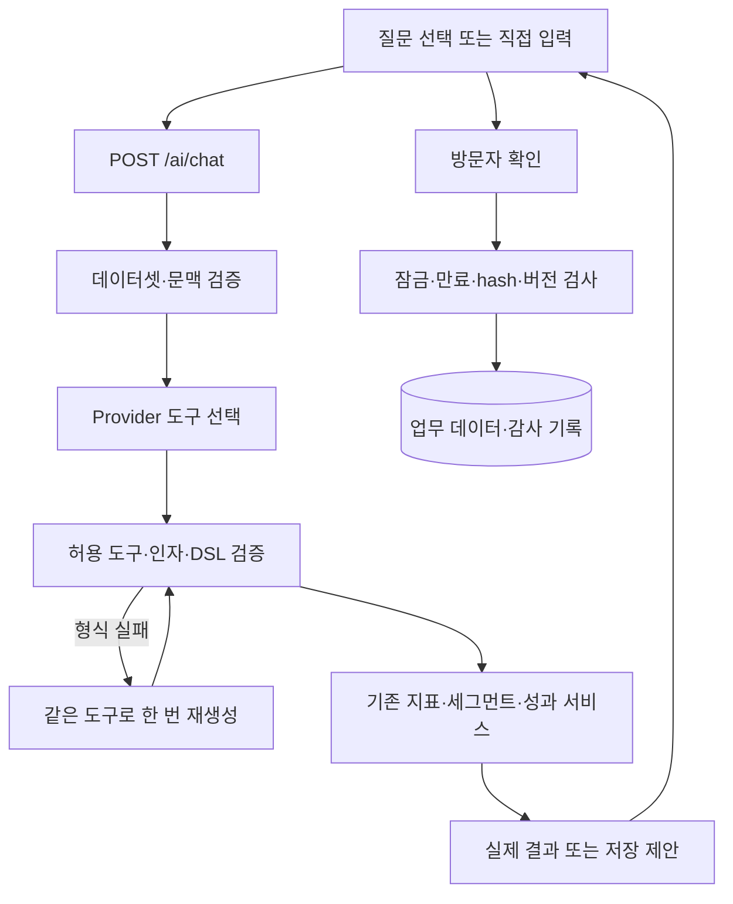

# AI 어시스턴트 — 구현과 사용 시나리오

코드 확인 기준: 2026-09-25. `/#/ai` 화면의 사용법·파일 지도·실행 흐름을 설명하는 기준 문서다. 이전 사용법·재설계 명세·실행 계획을 통합했다.

## 1. 역할과 구현 범위

AI는 자연어를 허용된 업무 도구 호출로 변환한다. 고객 수·전환율·매출은 기존 서비스와 PostgreSQL이 계산한다. 카피는 모델이 생성하되 서버 검증과 방문자 확인을 거쳐 저장한다.

| 질문 유형 | 도구 | 결과 |
| --- | --- | --- |
| 고객 지표 | get_metric | 데이터셋 전체의 실제 지표 |
| 대상 찾기 | preview_segment | 조건·인원·비중·프로파일 |
| 세그먼트 저장 준비 | create_segment_draft | 확인 저장 가능한 제안 |
| 완료 캠페인 비교 | compare_campaigns | 실제 집계 표·결과 링크 |
| 저장된 대상으로 캠페인 준비 | prepare_campaign | A/B 초안과 확인 저장 |
| 모호하거나 미지원 요청 | clarify | 필요한 정보 또는 지원 범위 안내 |

일반 채팅은 승인·발송을 실행하지 않는다. 개별 캠페인 검수·승인·모의 발송·AI 성과 분석은 Campaigns/Experiments에서 사용한다. 임의 SQL, 자유로운 캠페인 평균 계산, 특정 세그먼트 내부의 임의 지표 집계는 제공하지 않는다.

## 2. 화면 사용법

초기 화면은 짧은 소개, 업무별 질문 분류, 하단 입력창이다. 이전 지표 카드 세 개와 화면의 `/ai/insights` 호출은 제거했다. 인사이트 API와 관련 코드는 남아 있지만 현재 진입 화면에서 사용하지 않는다.

고객 현황·타깃 탐색·세그먼트 저장 준비·채널별 캠페인 비교·성과 순위 탐색의 다섯 분류에 총 22개 질문이 있다. 선택한 분류의 4~5개만 표시하며 모바일에서는 분류를 가로로 넘긴다. 질문 클릭은 입력창만 채우고 직접 전송해야 실행한다.

대화가 시작되면 초기 안내 대신 메시지가 쌓인다. 메시지 영역만 스크롤하고 입력창은 하단에 유지한다. Enter는 전송, Shift+Enter는 줄바꿈이며 한글 조합 중에는 Enter로 전송하지 않는다. 요청 중 입력·중복 확인은 잠근다. 오류·취소 시 입력을 복구한다.

A/B 초안은 채널·혜택·목표 요약, 좌우 문안 카드, 확인 저장 영역으로 구분한다. 내부 가설은 접기 영역에 두고 모바일 문안은 한 열로 배치한다. `textContent` 기반 DOM, 입력 label, 사용자/AI 구분 보조 텍스트와 `aria-live="polite"`를 사용한다.

### 후속 질문

`followups.js`가 마지막 구조화 결과·현재 문맥·저장 여부로 최대 세 개의 완성된 질문 문장을 만든다. 별도 LLM 호출은 없으며 임의 대화 전문을 해석하는 기능은 아니다.

| 직전 결과 | 이어지는 질문 방향 |
| --- | --- |
| 신규 고객 | 신규 미구매 대상·구매 전환율 |
| 활성 고객 | 전환율·장바구니 미구매 고객 |
| 반복 구매율 | 완료 주문 3건 이상·이메일 동의 대상 |
| 저장된 세그먼트 | 실제 이름을 넣은 이메일/푸시 초안 |
| 캠페인 비교 | 위 캠페인 N개를 클릭률·매출로 재조회 |
| 빈 비교 결과 | 전체 범위로 다시 조회 |

혜택을 넣은 후속 질문은 수정 가능한 예시다. 이전 혜택을 장기 기억해 복원한 값이 아니다. 문맥 제거 시 이전 목록을 지칭하지 않고, 요청 중에는 추천을 숨긴다. 새 대화·데이터셋·기간 변경 시 초기화한다.

## 3. 아키텍처와 파일 지도

Python/FastAPI·SQLAlchemy·PostgreSQL, 빌드 없는 JavaScript ES modules, HTTPX 기반 Responses API를 사용한다. 이 경로에 LangChain, MCP, 벡터 검색, RAG 또는 서버 대화 저장소는 없다.



일반 지표·비교는 모델이 도구를 고른 뒤 DB 결과를 바로 렌더링한다. 요약문을 위한 추가 모델 호출은 없다. 캠페인 준비와 조건·카피 재생성은 추가 호출을 사용할 수 있다. 화면의 명시적 초안 연결 문장은 아래 설명처럼 모델 호출을 생략한다.

| 파일 (저장소 루트 기준) | 책임 |
| --- | --- |
| `frontend/src/app/main.js`, `router.js`, `store.js` | 화면 수명·URL·기간·데이터셋 |
| `frontend/src/features/ai/index.js` | 메모리 대화, submit/confirm, 취소·복원, 화면 조립 |
| `frontend/src/features/ai/examples.js` | 22개 질문·분류 선택 |
| `frontend/src/features/ai/followups.js` | 결과 유형·문맥별 후속 질문 |
| `frontend/src/features/ai/input.js` | 입력창·문맥 칩·키보드·IME |
| `frontend/src/features/ai/conversation.js` | 말풍선·지표·초안·저장 상태 |
| `frontend/src/features/ai/comparison.js` | 비교 표·조회 범위·빈 결과·링크 |
| `frontend/src/features/segments/preview.js` | 공유 세그먼트 프로파일 |
| `frontend/src/api/client.js`, `components/dom.js` | fetch·응답 검증·오류·안전한 DOM |
| `frontend/styles/components.css` | 질문 탐색·대화·입력창·초안·모바일 스타일 |
| `app/api/routes/ai.py` | HTTP 진입점 |
| `app/ai/schemas.py`, `workspace_schemas.py` | 요청·문맥·비교 필터 계약 |
| `app/ai/tools.py` | strict 도구 JSON Schema |
| `app/ai/provider.py` | 실제/모의 모델·instructions·HTTP 재시도 |
| `app/ai/orchestrator.py` | 도구 검증·조건 재생성·서비스·확인 저장·로그 |
| `app/services/ai_context.py` | 리소스 재조회·세그먼트 목록·비교 범위 보정 |
| `app/domain/segments/fields.py`, `dsl.py` | 필드·연산자·타입·복잡도 제한 |
| `app/services/analytics.py`, `segments.py`, `performance.py` | 실제 지표·대상·성과 계산 |
| `app/ai/planning.py`, `campaigns.py` | 캠페인 설정·카피 생성·검증·캐시·적용 |
| `app/models/ai.py` | 제안과 실행 로그 |
| `alembic/versions/008_ai_conversation.py` | 로그 conversation ID와 인덱스 |

카피 내부는 캠페인 초안 LLM 해설 (이전 문서 정리됨), 성과 분석은 [AI-D](phase_ai_d.md)를 참고한다. `ai/performance.js`는 Campaigns/Experiments의 분석 UI이며 일반 채팅과 구분한다.

## 4. 요청·문맥·상태 수명

`POST /api/v1/ai/chat`은 prompt, dataset_id, from, to, reference_at, conversation_id와 선택적인 context_hint를 받는다. 화면 날짜는 한국 시간의 시작일 자정부터 종료일 다음 날 자정까지를 UTC `[from,to)`로 변환한다. 현재 채팅의 세그먼트 기준 시점은 `period.to`다.

응답의 result_type은 metric, segment_preview, clarification, campaign_comparison, campaign_draft다. message·data·mode·dataset_id·context_hint 등을 함께 반환한다.

문맥은 다음 두 종류다.

- `segment`: 확인 저장한 ID·최신 revision ID·이름·라벨.
- `campaign_list`: 최대 10개 캠페인 ID·라벨.

서버는 같은 데이터셋인지, 보관되지 않았는지, revision이 최신인지 재조회한다. 브라우저의 이름·라벨은 신뢰하지 않는다. 외부 모델 호출 후에도 참조를 확인한다. 변경된 문맥은 다시 대상을 고르도록 안내한다.

대화 전문은 다음 모델 요청에 전달하지 않는다. 서버에 대화 원문을 저장하지도 않는다. 브라우저 모듈 메모리는 같은 범위에서 다른 화면을 다녀오면 복원하며, 새 대화·데이터셋·기간 변경·새로고침 때 초기화한다. AbortController는 화면 이탈 요청과 늦은 응답 반영을 막는다. 이미 시작된 서버 저장을 브라우저 취소만으로 롤백한다는 보장은 아니다.

## 5. 실행 경로와 검증

### 고객 조건과 재생성

모델의 condition_json 문자열을 JSON 파싱하고 Pydantic DSL에 통과시킨다. 완료 주문 3건 이상은 다음 조건이다.

```json
{"field":"order_count","comparison":"GTE","value":3}
```

정수 필드에 문자열 `"3"`은 허용하지 않는다. 금액은 소수 문자열, 동의는 boolean이다. 그룹은 operator/conditions만, 단일 조건은 field/comparison/value로 구성한다. null 검사에는 value를 생략하고 깊이·조건 수 제한을 지킨다.

형식 오류는 실행 트랜잭션을 열기 전에 원래 질문과 일반 형식 안내로 한 번 재생성한다. 원래 도구 이름·인자 키와 동일한 DSL 검증을 다시 확인한다. 또 실패하면 AI_INVALID_OUTPUT 502로 종료한다. 임의 형변환이나 검증 우회는 하지 않는다. 재생성에는 추가 비용·시간이 발생하며 토큰을 로그에 합산한다. 실패 출력 원문·고객 행을 재생성 문맥에 추가하지 않는다. 호출 뒤 문맥과 데이터 버전을 다시 확인한다.

### 저장된 세그먼트에서 캠페인으로

화면의 정확한 후속 문장 “이 세그먼트로 캠페인 초안 만들어”와 “이 세그먼트로 캠페인 초안 만들어줘”는 모델 선택 없이 서버가 대상 문맥을 확인하고 채널·혜택을 질문한다. 문맥이 없으면 먼저 저장하도록 안내한다. 그 외 자연어는 provider가 처리한다.

채널·혜택을 명시하면 prepare_campaign이 저장된 revision을 CampaignSetup에 결합한다. 혜택이 이번 요청에서 왔는지 확인하고 planning 경로로 넘긴다. 기본 제안은 전환율 목표 5%, A/B 50:50이다. 혜택 유지·임의 숫자/단위·채널 길이·HTML/개인화 변수 금지 등의 카피 검증을 유지한다. 생성만으로 업무 캠페인은 저장되지 않는다.

### 캠페인 비교

같은 데이터셋의 미보관 COMPLETED 캠페인 중 선택 발송 기간에 SENT 이력이 있는 대상을 조회한다. 전환율·클릭률·매출·발송 수로 정렬하며 최대 10개를 반환한다. 집계 후보가 100개를 넘으면 범위를 좁히도록 요청한다. 금액은 Decimal로 정렬하고 비율은 이미 퍼센트다. null은 마지막에 둔다. 완료 시각과 발송 기간은 다른 개념이다.

scope 기본값은 dataset이다. “위 캠페인”, “그중”, “이 세그먼트”를 명시할 때 context로 제한한다. 서버 comparison_scope도 명확한 표현을 확인한다. 단순 이메일 비교는 이전 top 3 목록으로 자동 제한하지 않는다. 0건은 정상 빈 결과이며 “비교했습니다”와 동시에 표시하지 않는다. 서로 다른 대상·혜택의 관측 성과 순위가 인과적인 우열을 뜻하지는 않는다.

## 6. 확인 저장·로그·보호

AIActionProposal에 정규화 payload·SHA-256·30분 만료 등을 보관한다. 방문자가 확인하면 `/ai/actions/{proposal_id}/confirm`에 dataset ID를 보낸다. 임의 수정 payload나 confirmed=true를 받아 바로 실행하는 구조가 아니다.

데이터셋→제안 잠금, 범위·만료·hash·관련 데이터/정책/업무 버전 검사를 거쳐 기존 서비스를 호출한다. 업무 변경·감사 기록·제안 완료는 같은 트랜잭션이다. 중복 확인은 기존 결과를 반환하고 감사 저장 실패는 롤백한다. 업무별 세부 계약은 해당 세그먼트·캠페인 서비스에 있다.

모델에 자유 SQL·고객 연락처 조회 도구를 주지 않는다. 카피는 최소 집단 기준을 적용한 집계 프로파일을 사용한다. safe_prompt의 패턴 차단이 모든 개인정보를 탐지한다는 뜻은 아니다.

실행 로그에는 request/conversation ID, 데이터셋, provider/model, 도구, 상태, 시간·토큰을 기록한다. 프롬프트·응답 원문은 저장하지 않는다. 요청 ID로 실패 도구는 찾을 수 있어도 당시 잘못된 조건 원문까지 복원할 수는 없다. 과거 오류 원인 추정과 현재 재현 결과를 구분한다.

## 7. 다양한 시연 시나리오

수치는 데이터셋·기간·시드 상태에 따라 달라진다. 자유 문장은 live 모드를 사용한다. mock은 provider에 정의한 고정 예시만 지원한다.

| 질문·행동 | 기대 결과와 확인점 |
| --- | --- |
| 활성 고객 수를 알려줘 | 데이터셋 전체 실제 지표. 업무 저장 없음 |
| 완료 주문이 3건 이상인 반복 구매자를 찾아줘 | order_count GTE 3의 인원·프로파일 |
| 가입 후 30일 이내이고 구매 이력이 없는 고객을 찾아줘 | 가입 경과일·미구매 조건 확인 |
| 장바구니 이벤트는 있지만 구매 이벤트는 없는 고객을 찾아줘 | 이벤트 조건 미리보기. 주문과 이벤트 지표는 구분 |
| 60일 미구매, 누적 30만원 이상, 이메일 동의 고객을 저장할 초안으로 만들어줘 | 조건 검토 후 확인 버튼. 버튼 전 업무 저장 없음 |
| 확인 후 세그먼트 저장 | 저장된 ID/revision 문맥 칩 생성 |
| 이 세그먼트로 캠페인 초안 만들어 | 대상 확인 후 채널·혜택 질문. 모델 호출 없음 |
| 이메일로 15% 할인 쿠폰, 다정한 말투로 만들어줘 | A/B 초안. 확인 저장 후 DRAFT |
| VIP를 찾아줘 | 기준이 모호하면 금액·기간 등 추가 질문 |
| 전환율 상위 3개 캠페인을 보여줘 | 실제 비교 표·목록 문맥 |
| 위 캠페인을 클릭률 높은 순으로 비교해줘 | 이전 목록 안에서 재정렬 |
| 이메일로 발송한 캠페인들만 비교해줘 | 데이터셋 전체 이메일 비교 |
| 위 캠페인 중 이메일만 비교해줘 | 이전 목록 내 이메일. 없으면 정상 빈 결과 |
| 전체 캠페인을 기여 매출 순으로 비교해줘 | 전체 범위·실제 금액 정렬 |
| 자동 승인하고 발송해줘 | 지원 범위 안내. 실제 실행하지 않음 |
| 기간 변경 또는 문맥 제거 | 새 대화 또는 리소스 참조 해제 |
| 만료된 제안 확인 | 만료 오류. 재생성 필요 |
| 요청 중 다른 화면 이동 | 취소·입력 복구. 저장 결과는 필요 시 재확인 |

추천 시연: 고객 조회 → 세그먼트 초안 → 확인 저장 → 캠페인 준비 → 확인 저장. 비교 시연은 전환율 top 3 → 같은 목록 클릭률 → 전체 이메일 비교로 범위 차이를 보여준다.

## 8. 오류 점검

| 증상 | 확인 위치 | 대응 |
| --- | --- | --- |
| AI 연결 불가 | AI_MODE/키, /ai/status | 키를 출력하지 않고 서버 설정 확인 |
| AI 조건 검증 실패 | orchestrator, fields/dsl, 실행 로그 | 형식 재생성 후에도 실패하면 조건 구체화 |
| 초안 연결 실패 | context_hint, ai_context | 저장 여부·최신 revision·데이터셋 확인 |
| 비교 0건 | 기간·채널·scope | 전체 범위 또는 조회 기간 변경 |
| 카피 거절 | campaigns 생성 검증 | 혜택·숫자·채널 기준 확인 |
| 확인 저장 충돌 | 제안 만료·hash·관련 버전 | 최신 상태로 제안 재생성 |

## 9. 실행과 검증 증거

```powershell
.\.venv\Scripts\python.exe -m alembic upgrade head
.\.venv\Scripts\python.exe -m uvicorn app.main:app --reload
npm --prefix frontend test
npm --prefix frontend run test:e2e -- ai_workspace_flow.spec.js
$env:PYTEST_ADDOPTS='tests/integration/test_ai_workspace.py'
.\.venv\Scripts\python.exe -m scripts.run_db_tests
Remove-Item Env:PYTEST_ADDOPTS
```

서버 `.env`의 AI_MODE=live, OPENAI_API_KEY, AI_MODEL로 실제 모델을 설정한다. 키는 브라우저에 전달하거나 커밋하지 않는다. 실제 모델 테스트는 비용이 발생한다.

| 테스트 | 주요 범위 |
| --- | --- |
| tests/integration/test_ai_workspace.py | 문맥 격리·확인 저장·비교·초안 연결·조건 재생성 상한 |
| frontend/tests/ai-followups.test.js | 저장·비교·문맥 제거별 추천 |
| frontend/e2e/ai_workspace_flow.spec.js | 분류·입력·대화·저장·취소·IME·모바일 |

최근 검증: JavaScript 단위 18개, AI 화면 E2E 4개 통과. DB 워크스페이스 7개 통과 후 재생성 성공/실패 테스트 2개를 추가해 별도로 통과했다. 이 수치는 새 전체 백엔드 실행 결과가 아니다.

실제 AI와 로컬 중형 데이터셋에서 반복 구매자 질문의 미리보기 3,800명을 확인했다. 해당 기준 시점의 관측값이며 고정 기대값이 아니다. 이전 SMS/PUSH 목록을 문맥으로 전달한 비교 검증에서 전체 이메일은 8개, 이전 목록 내 이메일은 0개로 확인했다. 모든 예시 22개와 전체 브라우저 저장 경로를 실제 모델로 검증한 것은 아니다.

## 10. 문서 관리

중복된 ai_assistant_workspace.md, ai_assistant_redesign_spec.md, ai_assistant_redesign_execution_plan.md는 이 문서로 통합하고 삭제했다. 단계별 기능 문서·캠페인 생성 해설·블로그는 다른 범위와 독자를 위해 유지한다. UI·도구·문맥 계약이 바뀌면 파일 지도와 시나리오·검증 범위를 함께 갱신한다.
