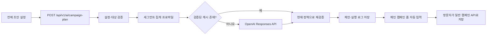

# 캠페인 전체 초안 LLM 구현 Walkthrough

작성일: 2026-09-20  
관련 단계: [AI-B 구현 문서](phase_ai_b.md), [단계 7 캠페인 편집](phase_7_campaigns.md)

## 1. 기능의 목적과 현재 사용자 흐름

이 기능은 Campaigns 화면 오른쪽의 **캠페인 어시스턴트**에서 시작한다. 방문자는 다음 입력을 확정한다.

- 저장된 대상 세그먼트
- 캠페인 목표
- 이메일·앱 푸시·SMS 중 발송 채널
- 제공할 혜택
- 공통 말투
- 주요 KPI와 목표값
- A안과 B안의 서로 다른 강조점
- 선택적인 추가 요청

목표·공통 말투·A/B 강조점은 준비된 항목 또는 `기타 (직접 입력)`을 사용할 수 있다. 생성 버튼을 누르면 캠페인 이름·목표·대상·채널·혜택·KPI와 A/B 제목·본문·가설이 메인 폼에 바로 채워진다. 이때 업무 캠페인은 아직 저장되지 않는다. 방문자가 결과를 수정하고 메인 폼의 **초안 저장 후 확인**을 눌러야 일반 캠페인 API로 저장된다.

현재 화면은 전체 초안 생성만 제공한다. 별도의 `카피만 수정` 선택 UI는 제거했다.



## 2. 파일별 책임

| 파일 | 책임 |
| --- | --- |
| `frontend/src/features/campaigns/setup.js` | 전체 초안 입력 UI, 단일 선택 체크박스, 기타 입력, 브라우저 사전 검증 |
| `frontend/src/features/campaigns/ai.js` | 생성 요청, 요청 취소, 응답 검증, 자동 입력, 완료·오류 알림 |
| `frontend/src/features/campaigns/index.js` | AI 결과를 캠페인 메인 폼에 적용하고 일반 저장 흐름 유지 |
| `app/api/routes/ai.py` | `/api/v1/ai/campaign-plan` HTTP 진입점 |
| `app/ai/schemas.py` | `CampaignSetup`, `CampaignBrief`, `ChatRequest` 입력 계약 |
| `app/ai/planning.py` | 확정 설정을 캠페인 brief와 LLM 요청으로 변환하고 대상 revision 확인 |
| `app/ai/campaigns.py` | 세그먼트 프로파일, 캐시, provider 호출, 출력 검증, 제안·로그 저장 |
| `app/ai/provider.py` | mock/live provider, OpenAI 요청, 카피 작성 instructions와 재시도 |
| `app/ai/tools.py` | strict function tool과 A/B 출력 JSON Schema |
| `app/models/ai.py` | `AICopyCache`, `AIActionProposal`, `AIExecutionLog` 영속 모델 |
| `alembic/versions/005a_ai_campaign_proposals.py` | 캠페인 제안용 컬럼과 FK |
| `alembic/versions/005b_ai_copy_cache.py` | 검증된 카피 캐시 테이블 |
| `tests/integration/test_ai_campaigns.py` | 생성·검증·캐시·동시 확인·원자성 PostgreSQL 테스트 |
| `frontend/e2e/ai_campaigns.spec.js` | 설정 UI·기타 입력·자동 채우기·캐시 안내 브라우저 테스트 |

## 3. 프런트엔드 입력과 요청

### 3.1 설정 UI

`campaignSetup()`은 체크박스를 단일 선택 그룹처럼 사용한다. 같은 그룹에서 다른 항목을 선택하면 기존 체크를 해제한다. 다음 항목은 기타 입력을 지원한다.

| 설정 | 기본값 | 기타 입력 제한 |
| --- | --- | ---: |
| 목표 | 재구매 유도 | 500자 |
| 공통 말투 | 다정하고 편안하게 | 200자 |
| A안 강조점 | 혜택 강조 | 200자 |
| B안 강조점 | 관계 강조 | 200자 |

대상 세그먼트와 혜택에는 임의 기본값을 넣지 않는다. KPI 기본값은 전환율 5%, A/B 비율은 50:50이다. A/B 강조점이 같거나, 기타 입력이 비었거나, KPI 범위가 잘못되면 API를 호출하기 전에 안내한다.

### 3.2 API 요청

화면은 `frontend/src/features/campaigns/ai.js`에서 같은 origin의 다음 엔드포인트를 호출한다.

```http
POST /api/v1/ai/campaign-plan
Content-Type: application/json
```

요청의 핵심 형태는 다음과 같다.

```json
{
  "dataset_id": "데이터셋 UUID",
  "from": "2026-08-22T15:00:00.000Z",
  "to": "2026-09-20T15:00:00.000Z",
  "reference_at": "2026-09-20T15:00:00.000Z",
  "prompt": "선택적 추가 요청",
  "campaign_setup": {
    "segment_revision_id": "세그먼트 revision UUID",
    "objective": "재구매 유도",
    "channel": "EMAIL",
    "benefit": "15% 할인 쿠폰",
    "brand_tone": "다정하고 편안하게",
    "primary_kpi": "conversion_rate",
    "target_value": "5",
    "a_focus": "혜택 강조",
    "b_focus": "관계 강조"
  }
}
```

화면 이동 시 `AbortSignal`로 진행 중인 요청을 취소한다. 응답이 도착하기 전에 메인 폼이 바뀌면 생성 결과로 새 입력을 덮어쓰지 않는다.

## 4. 백엔드 처리 순서

### 4.1 HTTP 진입점

`app/api/routes/ai.py`의 `campaign_plan()`은 DB 연결을 확인하고 `app.ai.planning.plan()`에 요청, 설정, request ID와 테스트용 provider override를 전달한다. 라우터는 업무 로직을 직접 처리하지 않는다.

### 4.2 확정 설정 검증

`CampaignSetup`은 다음을 서버에서 다시 검증한다.

- 대상 revision은 UUID여야 한다.
- 채널은 EMAIL/PUSH/SMS 중 하나다.
- 목표·말투·A/B 강조점은 비어 있을 수 없고 최대 길이를 지킨다.
- KPI는 지원 enum이고 목표값은 유한한 0 이상의 숫자 문자열이다.
- 비율 KPI 목표는 100 이하이다.
- A안과 B안의 강조점은 달라야 한다.

`planning.plan()`은 대상 revision이 현재 dataset의 보관되지 않은 최신 세그먼트에 속하는지 다시 조회한다. 화면에서 임의 UUID를 보내도 다른 dataset이나 오래된 대상을 적용할 수 없다.

### 4.3 캠페인 brief 구성

서버는 확정 설정을 `CampaignBrief`로 바꾼다.

- 캠페인 이름: `{세그먼트 이름} · {목표}`
- 목표·채널·혜택·말투·KPI: 사용자가 확정한 값
- 쿠폰 만료: 설정 기반 생성 단계에서는 `null`
- A/B 비율: 각각 5,000 basis point, 즉 50:50

LLM에는 다음과 같은 서버 생성 요청을 전달한다.

```text
확정된 설정으로 추가 질문 없이 카피를 생성하세요.
공통 브랜드 톤: 다정하고 편안하게.
A안: 혜택 강조.
B안: 관계 강조.
추가 요청: ...
```

따라서 대상·채널·혜택·KPI를 LLM이 임의로 결정하지 않는다. LLM의 책임은 확정 조건에 맞는 A/B 제목·본문·가설·생성 근거 작성이다.

### 4.4 고객 데이터 사용 범위

`app/ai/campaigns.py`는 저장된 세그먼트 조건으로 SQL 집계를 수행하고 최소 집단 기준이 적용된 프로파일을 만든다. 모델에는 고객 행·이메일·연락처를 보내지 않는다. 제공 가능한 문맥은 집계 프로파일, 캠페인 설정, 카피 정책, 기준 시점이다.

외부 AI 응답을 기다리는 동안 DB 트랜잭션을 유지하지 않는다. 응답 후 dataset의 data version과 캠페인 version을 다시 확인한다.

## 5. LLM provider와 구조화 출력

### 5.1 mock/live 전환

`app/ai/provider.py`는 두 provider를 제공한다.

- `MockProvider`: 비용 없이 고정된 결과를 반환하며 개발·CI에서 사용한다.
- `OpenAIProvider`: OpenAI Responses API를 호출한다.

서버 설정은 다음 환경변수를 사용한다.

```dotenv
AI_MODE=mock|live
AI_MODEL=gpt-4.1-mini
OPENAI_API_KEY=...
AI_TIMEOUT_SECONDS=20
AI_MAX_OUTPUT_TOKENS=2000
```

API 키는 서버 환경변수에만 두고 브라우저에 전달하지 않는다. 요청에는 `store=false`, `parallel_tool_calls=false`, `tool_choice=required`를 사용한다. timeout·출력 크기를 제한하고 429/5xx는 시간 예산 안에서 한 번 재시도한다.

### 5.2 카피 작성 instructions

`OpenAIProvider.plan()`의 캠페인 instructions는 다음을 요구한다.

- 이메일 제목은 짧은 후킹 한 가지에 집중한다.
- 본문은 짧은 문장 2~4개로 작성한다.
- 고객 관점으로 말하고 판에 박힌 수식어를 피한다.
- 공통 말투는 어조로 반영하되 톤 이름을 본문에 쓰지 않는다.
- subject/body에는 내부 설명이나 가설을 넣지 않는다.
- hypothesis에만 반응 가설을 쓴다.
- A/B 강조점과 첫 문장·제목 접근을 실제로 다르게 만든다.
- EMAIL/PUSH/SMS별 권장 분량을 지킨다.
- 입력에 없는 할인·기간·가격·상품·성과 숫자를 만들지 않는다.
- SMS에는 제목·가짜 링크를 만들지 않는다.

`CAMPAIGN_PROMPT_VERSION`은 현재 `ai-b-copy-2`다. 프롬프트 의미가 바뀌면 이 값을 올려 이전 캐시와 분리한다.

### 5.3 strict function tool

`app/ai/tools.py`의 `CAMPAIGN_TOOLS`는 모델이 다음 구조만 반환하게 한다.

```json
{
  "variants": [
    {
      "variant_name": "A",
      "subject": "제목",
      "body": "본문",
      "hypothesis": "검증 전 가설"
    },
    {
      "variant_name": "B",
      "subject": "제목",
      "body": "본문",
      "hypothesis": "검증 전 가설"
    }
  ],
  "rationale": "두 안의 비교 설계"
}
```

도구 스키마에 `strict=true`, 모든 속성 required, `additionalProperties=false`를 적용한다. 자유 텍스트 응답을 그대로 업무 객체로 저장하지 않는다.

## 6. 생성 결과의 서버 검증

구조화 출력도 신뢰하지 않고 `validate_generated()`와 단계 7의 `CampaignWrite`로 다시 검사한다.

1. A와 B가 정확히 한 개씩 있는지 확인한다.
2. subject/body/hypothesis 타입과 최대 길이를 확인한다.
3. 입력한 혜택 원문이 각 본문에 포함되는지 확인한다.
4. 입력 혜택·실제 만료일에 없는 숫자와 단위가 생겼는지 확인한다.
5. 채널별 제목·본문 제한을 적용한다.
6. 개인화 중괄호·HTML·금지 표현·필수 문구 규칙을 적용한다.
7. SMS 제목이 빈 문자열인지 확인한다.

금액의 천 단위 쉼표와 공백 같은 표기 차이는 정규화하지만 금액·비율·단위 변경은 허용하지 않는다. 쿠폰 만료는 UTC 숫자 조각이 아니라 Asia/Seoul의 날짜 전체로 비교한다.

첫 응답이 실패하면 오류 사유를 `validation_feedback`으로 provider에 전달해 한 번만 다시 생성한다. 두 번째도 실패하면 업무 데이터를 만들지 않고 구체적인 오류를 반환한다.

## 7. 같은 설정의 카피 캐시

`ai_copy_cache`는 검증을 통과한 `GeneratedCopy`만 보관한다.

캐시 키에는 다음 값이 포함된다.

- dataset ID와 data version
- segment revision ID와 집계 프로파일
- 캠페인 설정과 기타 직접 입력
- 선택적 추가 요청
- provider 모드·모델·구현 클래스
- `CAMPAIGN_PROMPT_VERSION`
- 카피 정책 버전과 최대 출력 토큰

같은 키가 있으면 LLM을 호출하지 않고 저장 결과를 현재 정책으로 다시 검증한다. 설정·추가 요청·대상 데이터·모델·프롬프트·정책이 달라지면 새 키로 생성한다. 오류 응답은 캐시하지 않는다.

동시에 같은 첫 요청이 들어오면 외부 모델 호출 자체는 둘 다 발생할 수 있다. 결과 저장 단계는 dataset 잠금으로 직렬화하고 먼저 저장된 결과를 공통 결과로 사용한다. 이후 요청은 토큰을 쓰지 않는다.

캐시에는 자유 입력 원문을 별도 컬럼으로 저장하지 않는다. hash 키와 생성된 카피만 보관한다. 자동 만료는 없고 dataset을 삭제하면 cascade로 함께 삭제된다.

## 8. 제안과 실제 업무 저장의 분리

초안 생성 성공 시 `AIActionProposal`에는 정규화된 전체 캠페인 payload, hash, dataset/data/policy version과 30분 만료가 저장된다. `AIExecutionLog`에는 provider·model·prompt version·도구·상태·시간·토큰만 기록하고 원문 프롬프트는 기록하지 않는다.

현재 Campaigns 화면은 제안 confirm API를 호출하지 않는다. 응답을 메인 폼에 채운 다음 방문자가 일반 `POST /api/v1/campaigns` 또는 `PUT /api/v1/campaigns/{id}`로 저장한다. 따라서 생성 버튼을 반복해도 업무 캠페인이 자동으로 늘어나지 않는다.

백엔드의 다음 호환 API는 유지되어 있다.

- `POST /api/v1/ai/campaign-draft`: 완성된 `campaign_brief`로 새 제안 생성
- `POST /api/v1/ai/copy-variants`: 기존 DRAFT 캠페인의 카피 제안
- `POST /api/v1/ai/actions/{proposal_id}/revise`: 편집 내용으로 새 제안 생성
- `POST /api/v1/ai/actions/{proposal_id}/confirm`: 제안을 일반 캠페인 서비스로 원자적 적용

이 경로는 현재 전체 초안 화면에서 사용하지 않지만, 제안 hash·만료·버전·중복 확인·감사 기록의 서버 계약을 검증하는 데 사용한다.

## 9. 응답과 화면 반영

대표 응답 필드는 다음과 같다.

```json
{
  "result_type": "campaign_draft",
  "mode": "live",
  "cache_hit": false,
  "segment_name": "휴면 VIP",
  "data": {
    "name": "휴면 VIP · 재구매 유도",
    "channel": "EMAIL",
    "variants": []
  }
}
```

프런트는 응답에 A/B 두 안과 필수 문자열이 있는지 확인한다. 요청 이후 메인 폼 fingerprint가 달라지지 않았으면 `applyFull()`로 다음을 적용한다.

- 캠페인 이름·목표·대상
- 채널·혜택·숨겨진 공통 말투
- KPI와 목표값
- A/B 제목·본문·가설·50:50 비율

제외 세그먼트·발송 예정 시각·쿠폰 만료는 기존 폼 값을 유지한다. 캐시 적중이면 `같은 설정의 이전 초안을 불러왔습니다` 알림을, 새 생성이면 `전체 초안을 입력했습니다` 알림을 4초 동안 표시한다.

## 10. 오류 처리

| 상황 | 처리 |
| --- | --- |
| 대상·혜택 누락 | 브라우저에서 호출 전 안내 |
| 기타 직접 입력 누락 | 해당 그룹 이름으로 안내 |
| 같은 A/B 강조점 | 브라우저와 서버에서 422 |
| 다른 dataset·보관된 revision | 서버에서 409/404 계열 오류 |
| 개인정보·API 키 패턴 입력 | `safe_prompt()`에서 422 |
| 모델 도구·스키마 오류 | 502, 업무 저장 없음 |
| 혜택 변경·임의 숫자 생성 | 한 번 재생성 후 실패 시 502 |
| 생성 중 폼 변경 | 프런트에서 자동 입력 취소 |
| 화면 이동 | 요청 abort, 이전 응답 무시 |
| AI 설정·장애 | 오류 유지, 수동 캠페인 작성 가능 |

## 11. 검증 방법

```powershell
.\.venv\Scripts\python.exe -m alembic upgrade head
.\.venv\Scripts\python.exe -m scripts.run_db_tests --create
npm --prefix frontend test
npm --prefix frontend run test:e2e
```

현재 검증 범위에는 다음이 포함된다.

- 설정 기반 생성에서 모델의 추가 질문을 건너뛰는지
- 목표·말투·A/B 강조점 기타 입력이 provider 요청에 반영되는지
- 같은 설정에서 provider 호출 없이 같은 카피를 반환하는지
- 새 요청마다 독립 proposal ID를 만드는지
- 데이터·설정·프롬프트 버전 변경 시 캐시를 무효화하는지
- 캐시 적중 로그의 토큰이 0인지
- 혜택·숫자·채널 정책 오류를 차단하는지
- 동시 confirm·오래된 제안·감사 실패에서 원자성을 지키는지
- 생성만으로 캠페인 업무 행을 만들지 않는지
- 브라우저에서 전체 초안을 자동 입력하고 캐시 알림을 표시하는지

2026-09-20 로컬 검증에서 백엔드 101개, JavaScript 단위 15개, Chromium E2E 14개를 통과했다.

## 12. 수정 지점 안내

| 바꾸려는 것 | 우선 수정할 위치 |
| --- | --- |
| 설정 항목·기본값·기타 UI | `frontend/src/features/campaigns/setup.js`, `app/ai/schemas.py` |
| 카피 문체·A/B 작성 전략 | `app/ai/provider.py`의 캠페인 instructions |
| 모델 출력 구조 | `app/ai/tools.py`, `GeneratedCopy` |
| 혜택·숫자·채널 검증 | `app/ai/campaigns.py` |
| 캐시 키·무효화 | `app/ai/campaigns.py`, `CAMPAIGN_PROMPT_VERSION` |
| 화면 자동 입력·알림 | `frontend/src/features/campaigns/ai.js`, `index.js` |
| 저장 트랜잭션·version 충돌 | `app/services/campaigns.py` |

카피 작성 instructions나 출력 의미를 변경하면 `CAMPAIGN_PROMPT_VERSION`을 함께 올리고 캐시·provider 테스트를 갱신한다. 검증 기준을 완화할 때는 기존 안전장치가 사라지지 않는지 경계·오류 테스트를 먼저 추가한다.
