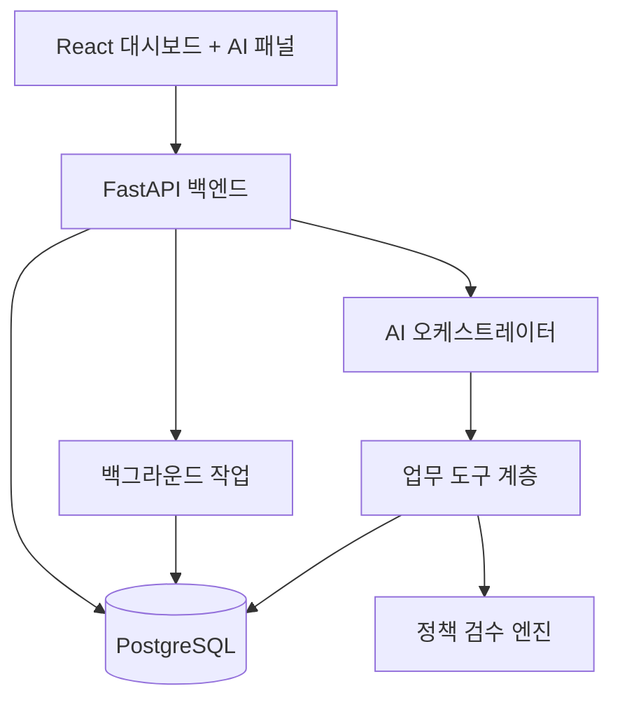
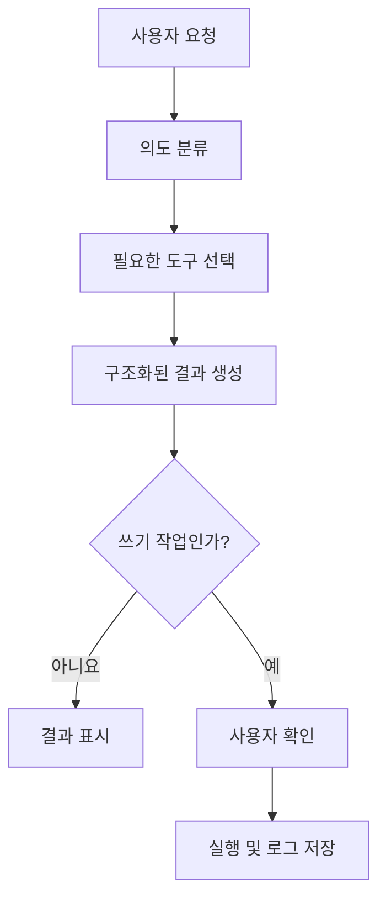

# AI 기반 CRM 캠페인 운영 자동화 툴

> 그로스 마케터 이직 포트폴리오용 전체 구현 문서  
> 문서 버전: v1.0  
> 프로젝트 가칭: **GrowthPilot**

실제 개발 순서와 완료 여부는 [단계별 상세 구현 계획](detailed_implementation_plan.md)을 기준으로 한다. 2026-09-19에 에이전트 조기 연결 순서로 조정했다. 공개 체험은 로그인 없이 제공하며 프런트는 HTML·CSS·JavaScript를 사용한다. 아래 원안과 충돌하면 상세 계획을 우선한다.

---

## 1. 프로젝트 한 줄 정의

고객 행동 데이터를 분석해 타깃 세그먼트를 만들고, 세그먼트별 CRM 캠페인 초안을 생성하며, 담당자 승인과 성과 분석까지 연결하는 **대화형 CRM 캠페인 운영 자동화 시스템**이다.

핵심 UI는 대시보드이고, 우측 AI 어시스턴트는 질문에 답하는 챗봇이 아니라 화면의 실제 업무를 실행하는 인터페이스로 사용한다.

---

## 2. 이 프로젝트가 해결하는 문제

CRM 마케터는 캠페인 하나를 운영할 때 여러 도구를 오가며 다음 작업을 반복한다.

1. 고객 데이터를 조회한다.
2. 타깃 조건을 SQL이나 필터로 작성한다.
3. 대상자 수와 특성을 분석한다.
4. 이메일·푸시·문자 카피를 작성한다.
5. 중복 발송, 수신 동의, 최근 발송 여부를 검수한다.
6. 캠페인 종료 후 성과 데이터를 다시 취합한다.
7. 결과를 보고서로 정리하고 다음 액션을 결정한다.

이 과정은 데이터 조회, 판단, 문안 작성, 검수, 보고가 분리되어 있어 시간이 오래 걸리고 휴먼 에러가 발생하기 쉽다.

GrowthPilot은 이 흐름을 하나의 화면에서 연결한다.

**기존 방식**

> SQL 조회 → 엑셀 정리 → 타깃 검토 → 카피 작성 → 발송 도구 등록 → 성과 취합 → 보고서 작성

**개선 방식**

> 자연어 요청 → 세그먼트 자동 생성 → 캠페인 초안 생성 → 정책 자동 검수 → 담당자 승인 → 모의 발송 → 성과 자동 분석

---

## 3. 포트폴리오에서 보여줄 핵심 역량

| 역량 | 프로젝트에서 보여주는 증거 |
|---|---|
| 그로스 전략 | 고객 행동과 퍼널을 기준으로 캠페인 가설을 설계 |
| CRM 마케팅 | 세그먼트, 채널, 발송 조건, 제외 조건을 구현 |
| 데이터 분석 | RFM, 전환율, 재구매율, 캠페인 기여 매출 분석 |
| 실험 설계 | A/B 카피, 핵심 지표, 성공 기준 설정 |
| 업무 자동화 | 타깃 추출부터 성과 보고까지 하나의 워크플로로 연결 |
| AI 활용 | 자연어 조건 변환, 카피 생성, 성과 원인 요약 |
| 프로덕트 사고 | 사용자 흐름, 승인 단계, 오류 방지 장치 설계 |
| 개발 협업 | 데이터 모델, API, 상태값, 예외 조건을 문서화 |

---

## 4. 프로젝트 범위

### 4.1 MVP에 반드시 포함할 기능

- 고객 및 이벤트 데이터 업로드
- CRM 핵심 지표 대시보드
- 조건 기반 세그먼트 생성
- 자연어 기반 세그먼트 조건 생성
- 세그먼트 프로파일 분석
- 캠페인 초안 생성
- 채널별 A/B 카피 생성
- 수신 동의·중복·피로도 정책 검수
- 담당자 승인 후 모의 발송
- 캠페인 성과 대시보드
- AI 성과 요약 및 다음 액션 추천
- 모든 AI 실행과 사용자 변경 내역 기록

### 4.2 2차 확장 기능

- 실제 이메일 또는 CRM 플랫폼 연동
- 캠페인 예약 실행
- 다단계 고객 여정 자동화
- 전환율 이상 탐지 및 알림
- 캠페인별 예산·할인 비용 관리
- 팀 권한과 승인 단계
- 임베딩 기반 유사 캠페인 검색

### 4.3 MVP에서 제외할 기능

- 실제 대량 메시지 발송
- 결제 기능
- 복잡한 멀티테넌시
- 완전 자율 캠페인 실행
- 실시간 스트리밍 데이터 처리
- 자체 모델 학습

포트폴리오의 핵심은 상용 CRM 전체를 복제하는 것이 아니라, **마케터의 반복 업무를 자동화한 하나의 완결된 흐름**을 증명하는 것이다.

---

## 5. 핵심 사용자

### Persona A: CRM 마케터

- 고객 세그먼트를 만들고 캠페인을 운영한다.
- SQL을 직접 작성하지 못하거나 작성 시간이 부담스럽다.
- 반복적인 카피 제작과 성과 보고를 줄이고 싶다.

### Persona B: 그로스 마케터

- 퍼널 문제를 발견하고 실험 가설을 만든다.
- 캠페인 성과와 고객 행동 변화를 빠르게 비교하고 싶다.
- 분석 결과를 다음 실행으로 바로 연결하고 싶다.

### Persona C: 마케팅 리드

- 캠페인의 타깃, 혜택, 예상 성과, 위험 요소를 검토한다.
- 승인되지 않은 발송과 과도한 할인 사용을 방지하고 싶다.

---

## 6. 대표 사용자 시나리오

### 시나리오 1: 휴면 VIP 재활성화 캠페인

사용자가 AI 어시스턴트에 입력한다.

> 최근 60일 동안 구매하지 않았지만 누적 구매액이 30만 원 이상이고 마케팅 수신에 동의한 고객을 찾아줘.

시스템은 다음을 수행한다.

1. 자연어를 구조화된 조건으로 변환한다.
2. 조건을 사용자에게 보여준다.
3. 조건에 맞는 고객 수를 계산한다.
4. 평균 구매액, 선호 카테고리, 마지막 구매일을 요약한다.
5. 사용자가 `세그먼트 저장`을 누르면 세그먼트를 생성한다.
6. `캠페인 만들기`를 누르면 목표와 채널을 입력받는다.
7. AI가 이메일·푸시 A/B 카피를 생성한다.
8. 정책 엔진이 수신 동의, 최근 발송, 중복 대상자를 검수한다.
9. 사용자가 최종 승인한다.
10. 모의 발송 후 성과 데이터를 생성하거나 업로드한다.
11. AI가 결과를 분석하고 다음 캠페인 가설을 제안한다.

### 시나리오 2: 성과 급락 원인 분석

사용자가 질문한다.

> 이번 주 재구매 캠페인 전환율이 왜 떨어졌어?

시스템은 기간별 데이터를 비교하고 다음 형식으로 답한다.

- 전환율: 4.8% → 3.1%
- 가장 큰 변화: 모바일 랜딩페이지 이탈률 12%p 증가
- 보조 원인: 최근 7일 내 중복 노출 고객 비율 증가
- 추천 액션: 모바일 랜딩페이지 점검, 최근 노출 고객 제외, 혜택형 카피 A/B 테스트

답변 하단에는 실제 후속 작업 버튼을 제공한다.

- 영향 캠페인 보기
- 제외 조건 추가
- 새 A/B 테스트 만들기

---

## 7. 서비스 정보 구조

### 7.1 전역 레이아웃

- 좌측: 주요 메뉴
- 중앙: 현재 업무 화면
- 우측: 접고 펼칠 수 있는 AI 어시스턴트
- 상단: 기간 필터, 알림, 사용자 정보

### 7.2 메뉴

1. Overview
2. Customers
3. Segments
4. Campaigns
5. Experiments
6. Reports
7. Data & Integrations
8. Settings

---

## 8. 화면별 상세 요구사항

### 8.1 Overview 대시보드

#### 목적

현재 고객 상태와 CRM 캠페인 성과를 한눈에 확인하고, 다음 행동으로 이동한다.

#### 주요 구성

- 기간 선택: 최근 7일, 30일, 90일, 직접 설정
- KPI 카드
  - 전체 고객 수
  - 활성 고객 수
  - 신규 고객 수
  - 휴면 고객 수
  - 구매 전환율
  - 재구매율
  - CRM 기여 매출
- 고객 상태 분포 차트
- 퍼널 차트
- 최근 캠페인 성과 테이블
- AI 인사이트 카드
- 추천 액션 목록

#### AI 인사이트 예시

> 최근 30일 재구매율이 이전 기간보다 2.4%p 감소했습니다. 첫 구매 후 30일 이내 두 번째 구매로 이어지지 않은 고객이 18% 증가했습니다.

### 8.2 Customers

#### 기능

- 고객 목록 조회
- 이름, 이메일, 상태, 가입일, 마지막 구매일 검색
- 고객 속성 필터
- 고객 상세 프로필
- 행동 이벤트 타임라인
- 캠페인 수신 이력
- 세그먼트 포함 여부

#### 고객 상세 핵심 정보

- 누적 구매액
- 주문 횟수
- 평균 주문 금액
- 최근 구매일
- 선호 카테고리
- 최근 30일 행동
- 이메일·푸시 수신 동의
- 피로도 점수
- RFM 등급

### 8.3 Segments

#### 세그먼트 생성 방식

1. 조건 빌더
2. 자연어 요청
3. 추천 템플릿

#### 조건 예시

- 마지막 구매일이 60일 이전
- 누적 구매액이 300,000원 이상
- 최근 30일 이메일 오픈 횟수가 2회 이상
- 마케팅 수신 동의가 true

#### 생성 결과

- 예상 대상자 수
- 전체 고객 대비 비중
- 평균 구매액
- 주요 연령대
- 주요 카테고리
- 최근 캠페인 반응률
- 제외 대상자 수와 사유

#### 안전장치

- AI가 만든 조건을 저장 전에 반드시 표시한다.
- 고객 수가 0명이거나 지나치게 많으면 경고한다.
- 민감정보 기반 차별적 조건은 허용하지 않는다.
- 저장된 세그먼트에는 생성자와 변경 이력을 남긴다.

### 8.4 Campaigns

#### 캠페인 생성 단계

1. 목표 설정
2. 세그먼트 선택
3. 채널 선택
4. 혜택과 메시지 설정
5. A/B 테스트 설정
6. 정책 검수
7. 승인
8. 예약 또는 모의 발송

#### 입력 항목

- 캠페인명
- 캠페인 목표
- 대상 세그먼트
- 제외 세그먼트
- 채널
- 핵심 혜택
- 브랜드 톤
- 발송 날짜와 시간
- 실험 비율
- 주요 KPI
- 목표값

#### 상태

| 상태 | 의미 |
|---|---|
| DRAFT | 작성 중 |
| REVIEW | 검수 요청 |
| APPROVED | 승인 완료 |
| SCHEDULED | 실행 예약 |
| RUNNING | 실행 중 |
| COMPLETED | 종료 |
| PAUSED | 일시 중지 |
| CANCELLED | 취소 |

### 8.5 캠페인 카피 에디터

#### 지원 채널

- 이메일 제목과 본문
- 앱 푸시 제목과 본문
- SMS 문구

#### AI 입력 문맥

- 캠페인 목표
- 고객 세그먼트 요약
- 브랜드 가이드
- 핵심 혜택
- 글자 수 제한
- 금지 표현
- 과거 우수 캠페인

#### 출력

- A안: 혜택 중심
- B안: 긴급성 중심 또는 개인화 중심
- 각 안의 생성 근거
- 예상 반응 가설
- 사용자가 직접 수정할 수 있는 편집 영역

### 8.6 정책 검수 화면

#### 자동 검수 규칙

- 마케팅 수신 미동의 고객 제외
- 탈퇴 고객 제외
- 하드 바운스 이메일 제외
- 최근 N일 내 같은 캠페인 수신자 제외
- 일일·주간 최대 노출 횟수 초과 고객 제외
- 실험군 간 중복 제거
- 유효기간이 지난 쿠폰 차단
- 필수 고지 문구 누락 확인
- 금지 표현 확인

#### 결과 표현

| 항목 | 인원 | 처리 |
|---|---:|---|
| 최초 세그먼트 | 1,284 | 기준 |
| 수신 미동의 | 103 | 제외 |
| 최근 중복 노출 | 74 | 제외 |
| 연락처 오류 | 12 | 제외 |
| 최종 발송 가능 | 1,095 | 승인 대상 |

### 8.7 Campaign Detail

- 기본 정보
- 사용한 세그먼트와 제외 조건
- 최종 카피
- 승인 이력
- 발송 결과
- 퍼널 성과
- A/B 비교
- AI 분석
- 다음 캠페인 생성 버튼

### 8.8 Reports

- 주간 CRM 요약
- 캠페인별 성과
- 세그먼트별 반응률
- 채널별 성과
- 기간 비교
- CSV 다운로드
- AI 요약 복사

---

## 9. AI 어시스턴트 설계

### 9.1 역할

AI 어시스턴트는 자유 대화가 아니라 다음의 정해진 업무를 수행한다.

- 데이터 지표 조회
- 세그먼트 조건 생성
- 세그먼트 저장 전 미리보기
- 캠페인 초안 생성
- 채널별 카피 생성
- 캠페인 성과 비교
- 성과 원인 요약
- 다음 액션 추천

### 9.2 허용된 도구

| 도구 | 기능 | 쓰기 여부 |
|---|---|---|
| get_metric | KPI 조회 | 읽기 |
| preview_segment | 조건에 맞는 고객 집계 | 읽기 |
| create_segment_draft | 세그먼트 초안 생성 | 임시 쓰기 |
| save_segment | 사용자 확인 후 저장 | 쓰기 |
| create_campaign_draft | 캠페인 초안 생성 | 임시 쓰기 |
| generate_copy | 카피 생성 | 임시 쓰기 |
| validate_campaign | 정책 검수 | 읽기 |
| request_approval | 승인 요청 | 쓰기 |
| analyze_campaign | 성과 분석 | 읽기 |

### 9.3 실행 원칙

- 조회 작업은 즉시 실행할 수 있다.
- 세그먼트 저장, 승인 요청, 발송은 사용자 확인이 필요하다.
- AI는 SQL을 직접 실행하지 않는다.
- 자연어 조건은 허용된 필드와 연산자로 구성된 JSON DSL로 변환한다.
- 최종 대상 고객의 개인정보를 LLM 프롬프트에 전달하지 않는다.
- 실행 결과에는 사용한 조건과 데이터 기준 시점을 표시한다.

### 9.4 응답 형식

AI 응답은 텍스트만 보여주지 않고 구조화된 카드로 표시한다.

```json
{
  "message": "조건에 맞는 고객은 1,284명입니다.",
  "result_type": "segment_preview",
  "data": {
    "estimated_count": 1284,
    "conditions": [],
    "exclusion_count": 189
  },
  "actions": [
    "SAVE_SEGMENT",
    "VIEW_CUSTOMERS",
    "CREATE_CAMPAIGN"
  ]
}
```

---

## 10. 자연어 세그먼트 조건 설계

### 10.1 JSON DSL 예시

```json
{
  "operator": "AND",
  "conditions": [
    {
      "field": "days_since_last_purchase",
      "comparison": "GTE",
      "value": 60
    },
    {
      "field": "total_purchase_amount",
      "comparison": "GTE",
      "value": 300000
    },
    {
      "field": "marketing_consent",
      "comparison": "EQ",
      "value": true
    }
  ]
}
```

### 10.2 허용 연산자

- EQ, NEQ
- GT, GTE, LT, LTE
- IN, NOT_IN
- BETWEEN
- CONTAINS
- IS_NULL, IS_NOT_NULL

### 10.3 검증

- 허용된 필드인지 확인
- 필드 타입과 값 타입 일치 확인
- 날짜 범위 역전 여부 확인
- 지나치게 넓은 대상 경고
- 개인정보 또는 민감정보 필드 차단
- 생성된 조건을 자연어로 역변환하여 사용자에게 확인

---

## 11. 데이터 설계

### 11.1 주요 테이블

#### users

| 필드 | 타입 | 설명 |
|---|---|---|
| id | UUID | 사용자 ID |
| email | VARCHAR | 로그인 이메일 |
| name | VARCHAR | 이름 |
| role | ENUM | MARKETER, REVIEWER, ADMIN |
| created_at | TIMESTAMP | 생성일 |

#### customers

| 필드 | 타입 | 설명 |
|---|---|---|
| id | UUID | 고객 ID |
| external_id | VARCHAR | 외부 CRM 고객 ID |
| email | VARCHAR | 이메일 |
| name | VARCHAR | 고객명 |
| signup_at | TIMESTAMP | 가입일 |
| marketing_consent | BOOLEAN | 수신 동의 |
| status | ENUM | ACTIVE, DORMANT, CHURN_RISK, WITHDRAWN |
| last_purchase_at | TIMESTAMP | 최근 구매일 |
| total_purchase_amount | DECIMAL | 누적 구매액 |
| order_count | INTEGER | 주문 수 |
| created_at | TIMESTAMP | 적재일 |

#### customer_events

| 필드 | 타입 | 설명 |
|---|---|---|
| id | UUID | 이벤트 ID |
| customer_id | UUID | 고객 ID |
| event_type | ENUM | VIEW, CART, PURCHASE, EMAIL_OPEN, CLICK 등 |
| event_at | TIMESTAMP | 발생 시각 |
| properties | JSONB | 상품, 금액, 채널 등 상세 값 |

#### segments

| 필드 | 타입 | 설명 |
|---|---|---|
| id | UUID | 세그먼트 ID |
| name | VARCHAR | 이름 |
| description | TEXT | 설명 |
| condition_json | JSONB | 세그먼트 조건 |
| estimated_count | INTEGER | 최근 계산 인원 |
| created_by | UUID | 생성자 |
| created_at | TIMESTAMP | 생성일 |
| updated_at | TIMESTAMP | 수정일 |

#### campaigns

| 필드 | 타입 | 설명 |
|---|---|---|
| id | UUID | 캠페인 ID |
| name | VARCHAR | 이름 |
| objective | VARCHAR | 목표 |
| segment_id | UUID | 대상 세그먼트 |
| channel | ENUM | EMAIL, PUSH, SMS |
| status | ENUM | 캠페인 상태 |
| scheduled_at | TIMESTAMP | 예약 시각 |
| primary_kpi | VARCHAR | 주요 KPI |
| target_value | DECIMAL | 목표값 |
| created_by | UUID | 생성자 |
| approved_by | UUID | 승인자 |

#### campaign_variants

| 필드 | 타입 | 설명 |
|---|---|---|
| id | UUID | 버전 ID |
| campaign_id | UUID | 캠페인 ID |
| variant_name | VARCHAR | A, B |
| subject | VARCHAR | 제목 |
| body | TEXT | 본문 |
| allocation_ratio | DECIMAL | 배분 비율 |
| hypothesis | TEXT | 실험 가설 |

#### campaign_deliveries

| 필드 | 타입 | 설명 |
|---|---|---|
| id | UUID | 발송 기록 ID |
| campaign_id | UUID | 캠페인 ID |
| customer_id | UUID | 고객 ID |
| variant_id | UUID | A/B 버전 |
| delivery_status | ENUM | SENT, FAILED, EXCLUDED |
| exclusion_reason | VARCHAR | 제외 사유 |
| sent_at | TIMESTAMP | 발송 시각 |

#### campaign_events

| 필드 | 타입 | 설명 |
|---|---|---|
| id | UUID | 이벤트 ID |
| campaign_id | UUID | 캠페인 ID |
| customer_id | UUID | 고객 ID |
| event_type | ENUM | DELIVERED, OPEN, CLICK, CONVERSION |
| event_at | TIMESTAMP | 발생 시각 |
| revenue | DECIMAL | 전환 매출 |

#### approvals

| 필드 | 타입 | 설명 |
|---|---|---|
| id | UUID | 승인 ID |
| campaign_id | UUID | 캠페인 ID |
| requester_id | UUID | 요청자 |
| reviewer_id | UUID | 승인자 |
| status | ENUM | PENDING, APPROVED, REJECTED |
| comment | TEXT | 의견 |
| decided_at | TIMESTAMP | 처리 시각 |

#### ai_execution_logs

| 필드 | 타입 | 설명 |
|---|---|---|
| id | UUID | 로그 ID |
| user_id | UUID | 실행 사용자 |
| action_type | VARCHAR | AI 작업 유형 |
| input_summary | TEXT | 입력 요약 |
| tool_name | VARCHAR | 호출 도구 |
| output_summary | TEXT | 결과 요약 |
| status | ENUM | SUCCESS, FAILED |
| created_at | TIMESTAMP | 실행일 |

---

## 12. 핵심 지표 정의

| 지표 | 계산식 |
|---|---|
| 오픈율 | 오픈 고객 수 / 전달 성공 고객 수 × 100 |
| 클릭률 | 클릭 고객 수 / 전달 성공 고객 수 × 100 |
| CTOR | 클릭 고객 수 / 오픈 고객 수 × 100 |
| 전환율 | 전환 고객 수 / 전달 성공 고객 수 × 100 |
| 재구매율 | 2회 이상 구매 고객 수 / 구매 고객 수 × 100 |
| 캠페인 매출 | 캠페인 기여 전환의 revenue 합계 |
| 고객당 매출 | 캠페인 매출 / 전달 성공 고객 수 |
| 증분 전환율 | 실험군 전환율 - 통제군 전환율 |
| 증분 매출 | 증분 전환 수 × 평균 주문 금액 |

성과를 과장하지 않으려면 단순 전환율뿐 아니라 통제군 또는 이전 기간 비교를 제공한다.

---

## 13. API 설계

### 13.1 인증

```http
POST /api/auth/login
GET  /api/auth/me
```

### 13.2 고객

```http
GET  /api/customers
GET  /api/customers/{customerId}
GET  /api/customers/{customerId}/events
POST /api/data/import/customers
POST /api/data/import/events
```

### 13.3 대시보드

```http
GET /api/dashboard/overview?from=&to=
GET /api/dashboard/funnel?from=&to=
GET /api/dashboard/segments?from=&to=
```

### 13.4 세그먼트

```http
GET    /api/segments
POST   /api/segments/preview
POST   /api/segments
GET    /api/segments/{segmentId}
PUT    /api/segments/{segmentId}
DELETE /api/segments/{segmentId}
```

### 13.5 캠페인

```http
GET  /api/campaigns
POST /api/campaigns
GET  /api/campaigns/{campaignId}
PUT  /api/campaigns/{campaignId}
POST /api/campaigns/{campaignId}/validate
POST /api/campaigns/{campaignId}/request-approval
POST /api/campaigns/{campaignId}/approve
POST /api/campaigns/{campaignId}/simulate-send
GET  /api/campaigns/{campaignId}/performance
```

### 13.6 AI

```http
POST /api/ai/chat
POST /api/ai/segment-condition
POST /api/ai/campaign-draft
POST /api/ai/copy-variants
POST /api/ai/performance-analysis
```

### 13.7 주요 요청 예시

```json
POST /api/ai/segment-condition

{
  "prompt": "최근 60일 동안 구매하지 않은 누적 구매액 30만 원 이상의 수신 동의 고객",
  "referenceDate": "2026-09-14"
}
```

```json
{
  "condition": {
    "operator": "AND",
    "conditions": []
  },
  "humanReadable": "마지막 구매 후 60일 이상, 누적 구매액 30만 원 이상, 마케팅 수신 동의 고객",
  "warnings": [],
  "requiresConfirmation": true
}
```

---

## 14. 시스템 아키텍처



### 권장 기술 스택

#### Frontend

- React + TypeScript + Vite
- Tailwind CSS
- shadcn/ui 또는 React-Bootstrap 중 하나
- React Router
- TanStack Query
- Recharts
- React Hook Form + Zod

#### Backend

- FastAPI
- SQLAlchemy 2.x
- Pydantic
- Alembic
- PostgreSQL
- Redis 및 Celery는 예약 작업이 필요할 때만 추가

#### AI

- OpenAI API의 구조화 출력과 tool calling
- LangGraph는 복수 단계 상태 관리가 실제로 필요할 때만 사용
- 단순 생성 기능은 일반 서비스 함수로 구현

#### 개발·배포

- Docker Compose
- Pytest
- Vitest 또는 React Testing Library
- GitHub Actions
- Vercel 또는 Netlify: 프론트엔드
- Render, Railway 또는 Fly.io: 백엔드·DB

---

## 15. MCP와 RAG의 사용 범위

### 15.1 MCP

MCP는 프로젝트 이름을 화려하게 만들기 위한 요소가 아니라, CRM 데이터나 캠페인 실행 기능을 AI가 표준화된 도구로 호출하게 할 때 사용한다.

권장 MCP 도구 예시:

- `get_customer_metrics`
- `preview_customer_segment`
- `get_campaign_performance`
- `create_campaign_draft`

다만 포트폴리오 MVP에서는 백엔드 내부 tool calling만으로도 충분하다. MCP 서버 분리는 다음 조건일 때 진행한다.

- AI 클라이언트를 여러 개 연결할 계획이 있다.
- CRM 기능을 독립 서비스로 재사용할 계획이 있다.
- MCP 설계 역량 자체를 별도로 증명하려 한다.

### 15.2 RAG

고객 행 데이터 조회에는 RAG를 사용하지 않는다. 정확한 집계와 필터링이 필요하므로 SQL이 맞다.

RAG는 다음 비정형 문서 검색에만 사용한다.

- 브랜드 보이스 가이드
- 금지 표현과 법적 검수 규칙
- 과거 캠페인 회고 문서
- 상품 설명과 FAQ

즉, 역할은 다음과 같이 분리한다.

| 데이터 | 처리 방식 |
|---|---|
| 고객, 주문, 이벤트, 캠페인 성과 | SQL 조회 |
| 브랜드 가이드, 정책, 회고 문서 | RAG 검색 |
| 캠페인 판단 및 카피 생성 | LLM |
| 수신 동의, 중복, 피로도 검수 | 규칙 엔진 |

---

## 16. AI 워크플로



### 캠페인 생성 워크플로

1. 사용자의 목적을 추출한다.
2. 대상 세그먼트를 확인하거나 추천한다.
3. SQL 집계 결과로 세그먼트 특성을 만든다.
4. 필요할 경우 RAG로 브랜드 가이드를 가져온다.
5. LLM이 캠페인 전략과 카피를 생성한다.
6. 규칙 엔진이 발송 가능성과 문안을 검수한다.
7. 사용자 수정 및 승인 후 초안을 저장한다.

---

## 17. 보안 및 신뢰성

- 고객 이메일은 화면에서 일부 마스킹한다.
- LLM에는 고객별 개인정보 대신 집계된 세그먼트 특성을 전달한다.
- 수신 동의 여부는 AI 판단이 아니라 DB 값과 규칙으로 처리한다.
- AI가 생성한 모든 조건과 카피는 사람이 확인한다.
- 발송, 승인, 조건 변경 이력을 남긴다.
- 사용자 역할에 따라 승인 권한을 제한한다.
- 프롬프트 인젝션 방지를 위해 업로드 문서는 명령이 아닌 참고 자료로 취급한다.
- API 입력값과 AI 구조화 출력을 모두 스키마 검증한다.
- 실패한 AI 응답은 업무 데이터에 바로 저장하지 않는다.

---

## 18. 샘플 데이터 설계

외부 CRM 인증 없이도 전체 기능을 시연할 수 있도록 가상 이커머스 데이터를 사용한다.

### 권장 규모

- 고객: 10,000명
- 상품: 300개
- 주문: 30,000건
- 행동 이벤트: 200,000건
- 캠페인: 30개
- 캠페인 이벤트: 100,000건

### 데이터에 포함할 패턴

- 신규 고객군
- 고가치 충성 고객군
- 최근 구매가 끊긴 VIP
- 장바구니 이탈 고객
- 이메일 반응은 높지만 구매하지 않는 고객
- 과도한 메시지 노출로 반응이 감소한 고객
- 모바일 랜딩페이지에서 이탈한 고객

데이터에 의도적인 패턴을 심어야 AI 분석 결과와 대시보드 인사이트가 설득력 있게 나온다.

---

## 19. A/B 테스트 설계

### 예시 가설

> 휴면 VIP에게 단순 할인보다 기존 구매 카테고리를 반영한 개인화 혜택을 제시하면 구매 전환율이 높아질 것이다.

### 실험 구성

- A안: 15% 할인 강조
- B안: 선호 카테고리 신상품과 전용 혜택 강조
- 50:50 무작위 배분
- 주요 지표: 구매 전환율
- 보조 지표: 클릭률, 고객당 매출
- 가드레일 지표: 수신 거부율

### 결과 표시

- 표본 수
- 전환 수와 전환율
- 절대 차이와 상대 개선율
- 신뢰구간 또는 통계적 유의성
- 수신 거부율 변화
- 승리안과 주의사항

표본이 부족한 경우 AI가 승자를 단정하지 않고 `판단 보류`로 표시해야 한다.

---

## 20. 에러 및 예외 처리

| 상황 | 처리 방식 |
|---|---|
| 데이터 업로드 컬럼 누락 | 필요한 컬럼과 오류 행 표시 |
| 세그먼트 결과 0명 | 조건 완화 제안, 저장은 허용 |
| 타깃이 전체 고객의 80% 초과 | 과도한 대상 경고 |
| AI가 허용되지 않은 필드 생성 | 스키마 검증 후 재생성 |
| 정책 검수 실패 | 발송·승인 버튼 비활성화 |
| A/B 비율 합계가 100% 아님 | 저장 차단 |
| 성과 데이터가 부족함 | 분석 범위와 한계 표시 |
| AI API 실패 | 재시도 및 수동 입력 제공 |
| 중복 실행 | idempotency key로 방지 |

---

## 21. 테스트 계획

### 단위 테스트

- 세그먼트 DSL 검증
- SQL 조건 변환
- 수신 동의 제외 규칙
- 피로도 제한 규칙
- KPI 계산식
- 캠페인 상태 전환

### 통합 테스트

- 자연어 요청 → 세그먼트 미리보기
- 캠페인 생성 → 검수 → 승인
- 모의 발송 → 이벤트 적재 → 성과 집계
- AI 분석 응답의 스키마 검증

### E2E 테스트

1. 로그인
2. 세그먼트 생성
3. 캠페인 초안 생성
4. 카피 수정
5. 정책 검수
6. 승인
7. 모의 발송
8. 결과 확인

### 핵심 합격 기준

- 미동의 고객이 발송 대상에 포함되지 않는다.
- AI가 만든 조건과 실제 집계 조건이 일치한다.
- 승인되지 않은 캠페인은 실행되지 않는다.
- 동일 고객이 A/B 양쪽에 포함되지 않는다.
- KPI 계산이 테스트 데이터의 기대값과 일치한다.

---

## 22. 개발 단계와 우선순위

### Phase 1: 기반 구축

- 프로젝트 구조 생성
- DB 스키마와 마이그레이션
- 샘플 데이터 생성기
- 공개 데이터셋 선택과 감사 이력
- 공통 레이아웃

### Phase 2: 분석 기능

- 고객 목록과 상세 화면
- Overview KPI
- 이벤트·구매 데이터 집계
- 세그먼트 조건 빌더
- 세그먼트 미리보기

### Phase 3: AI 기능

- 최소 대화 패널과 실제 LLM 도구 호출을 분석 기능 직후 연결
- 지표 조회·조건 미리보기·방문자 확인 후 세그먼트 저장
- 자연어 → 세그먼트 DSL
- 세그먼트 프로파일 요약
- AI 실행 로그·실패 처리·제안 만료와 중복 실행 방지
- 캠페인 서비스 완성 직후 초안·A/B 카피 도구 확장

### Phase 4: 운영 자동화

- 정책 검수 엔진
- 승인 워크플로
- 모의 발송
- 캠페인 상태 관리

### Phase 5: 성과와 포트폴리오 마감

- 성과 대시보드
- AI 성과 분석
- 시연 시나리오
- 테스트 보강
- 배포
- README와 포트폴리오 케이스 스터디

### 현실적인 구현 순서

단계 0~3은 완료했다. 앞으로는 검증된 업무 서비스를 차례로 에이전트 도구에 연결한다. 상세 단계 11·12는 한꺼번에 마지막에 수행하지 않고 AI-A~D로 분할한다. MCP·RAG·멀티에이전트는 초기 체험의 선행 조건이 아니다.

1. 단계 4: HTML·CSS·JavaScript 공통 화면과 AI 패널 영역.
2. 단계 5~6: 고객·지표 조회와 세그먼트 서비스·화면.
3. AI-A: 실제 LLM으로 자연어 지표 조회 → 세그먼트 미리보기 → 확인 후 저장.
4. 단계 7 → AI-B: 캠페인 편집 서비스 구현 후 초안·카피 생성 도구 연결.
5. 단계 8 → AI-C: 검수·승인 구현 후 검수 도구와 결과 카드 연결. 승인 결정은 방문자가 직접 수행.
6. 단계 9~10 → AI-D: 모의 발송·성과 집계 구현 후 근거 지표 기반 분석·후속 초안 연결.
7. 단계 13: 전체 시연·통합 테스트·배포. RAG·MCP는 MVP 이후 필요에 따라 확장.

---

## 23. MVP 완료 기준

아래 시연이 끊기지 않고 가능하면 MVP가 완료된 것이다.

1. 사용자가 대시보드에서 재구매율 하락을 확인한다.
2. AI에게 휴면 VIP 고객을 찾아달라고 요청한다.
3. AI가 구조화된 조건과 예상 고객 수를 보여준다.
4. 사용자가 세그먼트를 저장한다.
5. AI가 캠페인 전략과 A/B 카피를 만든다.
6. 정책 검수에서 제외 인원과 사유가 표시된다.
7. 담당자가 승인하고 모의 발송한다.
8. 결과 화면에서 A/B 성과를 비교한다.
9. AI가 결과를 요약하고 다음 실험을 제안한다.

---

## 24. 성과 측정 계획

실제 회사 데이터가 없으므로 가짜 매출 상승을 프로젝트 성과로 주장하면 안 된다. 대신 자동화 전후의 작업 시간과 단계 수를 측정한다.

### 측정 지표

- 캠페인 생성 소요 시간
- 수동 입력 단계 수
- 타깃 조건 작성 시간
- 검수 누락 건수
- 성과 보고서 작성 시간
- 재사용 가능한 캠페인 템플릿 수

### 목표 예시

| 업무 | 기존 가정 | 자동화 후 목표 |
|---|---:|---:|
| 타깃 정의와 추출 | 30분 | 5분 |
| A/B 카피 초안 | 40분 | 10분 |
| 발송 전 체크 | 20분 | 5분 |
| 성과 보고 작성 | 60분 | 10분 |
| 전체 캠페인 준비 | 150분 | 30분 |

위 수치는 `실제 성과`가 아니라 사용자 테스트를 통해 검증할 **목표 가설**로 표현한다.

---

## 25. 포트폴리오 케이스 스터디 구성

### 1. 문제

CRM 캠페인 운영이 데이터 조회, 문안 작성, 검수, 보고 단계로 분리되어 반복 작업과 오류가 발생한다.

### 2. 가설

세그먼트 생성부터 성과 분석까지 하나의 워크플로로 연결하면 캠페인 준비 시간을 줄이고 마케터가 실험 설계에 더 집중할 수 있다.

### 3. 사용자 흐름

대시보드에서 문제 발견 → AI에게 작업 지시 → 결과 검수 → 캠페인 실행 → 성과 분석 → 다음 실험 생성

### 4. 핵심 설계 판단

- 챗봇 단독 UI 대신 대시보드와 실행형 AI 패널을 결합했다.
- 정형 데이터는 SQL, 비정형 문서는 RAG로 처리했다.
- 수신 동의와 발송 제한은 AI가 아닌 규칙 엔진으로 처리했다.
- 쓰기 작업에는 승인 단계를 넣었다.

### 5. 구현 결과

- 자연어 기반 세그먼트 생성
- 채널별 A/B 캠페인 생성
- 정책 자동 검수
- 성과 분석과 다음 액션 추천

### 6. 검증

- 사용자 과업 완료 시간
- 자동화 전후 클릭 수와 단계 수
- 조건 정확도
- 정책 위반 차단 여부
- 사용자 인터뷰 피드백

### 7. 회고

- AI가 잘하는 판단과 규칙으로 고정해야 하는 판단을 분리했다.
- 자동 생성보다 검수 가능성과 실행 이력이 실무 도입에서 중요했다.
- 향후 실제 CRM 연동과 증분 효과 측정으로 확장할 수 있다.

---

## 26. 면접용 설명

### 30초 버전

> CRM 마케터가 고객 데이터를 조회하고 타깃을 만들고 카피를 작성한 뒤 성과를 보고하는 반복 업무를 하나의 흐름으로 자동화한 프로젝트입니다. 대시보드에서 문제를 발견하면 AI 어시스턴트가 자연어 요청을 세그먼트 조건으로 바꾸고 캠페인 초안을 생성합니다. 수신 동의나 중복 발송처럼 정확성이 필요한 부분은 규칙 엔진으로 검수하고, 담당자 승인 후 실행되도록 설계했습니다.

### 업무 자동화 강조 버전

> 단순히 광고 카피를 생성하는 챗봇이 아니라, 타깃 추출·캠페인 제작·검수·승인·성과 분석을 연결한 내부 운영 툴입니다. AI는 조건 해석과 초안 작성에 사용하고, 개인정보와 발송 정책은 SQL과 규칙 엔진으로 처리해 실제 업무에서 사용할 수 있는 통제 구조를 설계했습니다.

### 개발보다 마케팅 역량을 강조하는 버전

> 개발 기술을 보여주는 것이 목적이 아니라 CRM 마케터의 병목을 정의하고 자동화 가능한 단계와 사람이 판단해야 할 단계를 구분한 것이 핵심입니다. 캠페인 목표, 세그먼트, 실험 가설, 주요 지표와 가드레일 지표까지 제품 안에서 연결했습니다.

---

## 27. README 첫 화면 예시

### GrowthPilot

AI-powered CRM campaign operations workspace

고객 행동 데이터에서 타깃 세그먼트를 찾고, 캠페인 초안과 A/B 카피를 생성하며, 정책 검수와 성과 분석까지 자동화합니다.

#### 주요 기능

- 자연어 기반 고객 세그먼트 생성
- 세그먼트 프로파일 자동 분석
- 이메일·푸시·SMS 캠페인 초안 생성
- 마케팅 수신 동의와 발송 피로도 자동 검수
- 승인 기반 모의 발송
- 캠페인 성과 분석 및 다음 실험 추천

#### 설계 원칙

- 정형 데이터 분석은 SQL
- 비정형 문서 검색은 RAG
- 생성과 해석은 LLM
- 정책 준수는 규칙 엔진
- 실제 실행은 사람의 승인 후 진행

---

## 28. 최종 권장 구현 범위

취업 포트폴리오 완성도를 기준으로 아래까지만 확실하게 구현하는 것이 가장 효율적이다.

### 반드시 구현

- 완성도 높은 Overview 대시보드
- 고객 목록과 상세
- 세그먼트 조건 빌더
- 자연어 세그먼트 생성
- 캠페인 생성 마법사
- AI 카피 A/B 생성
- 정책 검수 결과
- 승인과 모의 발송
- 성과 분석 화면
- 대표 시나리오용 샘플 데이터

### 시간이 남으면 구현

- 브랜드 가이드 RAG
- AI 대화 이력
- 주간 보고서 자동 생성
- 캠페인 이상 탐지

### 굳이 구현하지 않아도 되는 것

- 실제 대량 이메일 발송
- 여러 CRM API 동시 연동
- 복잡한 멀티에이전트
- 자체 벡터 DB 인프라
- 과도한 마이크로서비스 분리

이 프로젝트의 평가 포인트는 기술 개수보다 **마케팅 업무를 얼마나 정확하게 이해하고, 실행 가능한 자동화 흐름으로 바꿨는지**다.

---

## 29. 최종 프로젝트 소개 문구

> 고객 행동 데이터 분석부터 세그먼트 생성, 캠페인 기획, 발송 전 정책 검수, 성과 분석까지 CRM 운영 전 과정을 연결한 AI 기반 내부 자동화 툴입니다. 자연어로 타깃과 캠페인을 만들 수 있지만, 수신 동의와 발송 제한은 규칙 엔진으로 검증하고 최종 실행에는 담당자 승인을 요구하도록 설계했습니다. 이를 통해 단순 생성형 AI가 아니라 마케팅 실행 프로세스를 개선하는 방식으로 AI를 활용했습니다.
