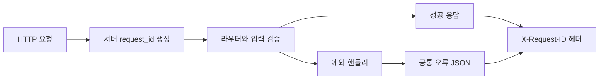

# 단계 0 구현 Walkthrough

검증일: 2026-09-17  
기준: 현재 작업 디렉터리의 코드와 직접 재실행한 테스트  
관련 문서: [상세 구현 계획](detailed_implementation_plan.md), [API 계약](api_contract.md), [지표 정의](metric_definitions.md)

## 1. 어디까지 구현되었나?

**단계 0의 공통 코드와 업무 규칙 문서는 구현되어 있다.** 실제 고객 데이터를 저장·조회하는 기능은 다음 단계다. 계획 문서의 1~3절은 프로젝트 방향과 목표 구조를 포함하므로, 거기에 등장하는 모든 기능이 구현되었다는 뜻은 아니다.

| 구분 | 현재 상태 | 확인 근거 |
| --- | --- | --- |
| FastAPI 실행·health·문서 | 실행 가능 | `app/main.py`, 기존 API 테스트 |
| 백엔드 계층별 폴더 | 기본 패키지 구성 | `db`, `models`, `repositories`, `services` 등은 대부분 뼈대 |
| 오류 응답·요청 ID | 실제 앱에 연결됨 | `install_error_handlers()` 호출 |
| 페이지네이션·기간·금액 | 재사용 모델 구현, 테스트 검증 | 아직 고객 목록 API에는 연결되지 않음 |
| Clock | 앱에 기본 Clock 등록, 의존성 함수 제공 | 업무 서비스에서 기준 시점을 꺼내 쓰는 연결은 후속 작업 |
| 고객 상태·구매 경과일·비율 | DB 없는 순수 계산 함수 구현 | 고정 입력으로 경계 테스트 |
| UTC·Numeric DB 저장 | 계약만 확정 | DB 연결과 모델 미구현 |
| 활성 고객·전환율·매출 집계 | 계산 기준 문서화 | SQL 집계와 대시보드 미구현 |
| HTML·CSS·JS 화면 | 목표 구조 정의 | 실제 페이지와 화면 로직 미구현 |
| Docker·worker·AI·캠페인 | 후속 구현 계획 | 실행 가능한 업무 기능 미구현 |

따라서 단계 0 완료는 **이후 업무 기능이 재사용할 코드와 계산 기준을 마련했다**는 의미다. 실제 DB를 대상으로 전체 기능을 검증했다는 의미는 아니다.

## 2. 구현 파일 안내

| 파일 | 무엇을 구현했나 | 왜 필요한가 |
| --- | --- | --- |
| [errors.py](../app/core/errors.py) | 오류 모델·예외 핸들러·요청 ID | 오류 응답을 화면에서 같은 방식으로 처리 |
| [time.py](../app/core/time.py) | UTC 변환·Clock·날짜 범위 변환 | 날짜 경계와 테스트 기준 시점 통일 |
| [common.py](../app/schemas/common.py) | Pagination·Page·ReportingPeriod·Money | API별로 같은 검증을 반복하지 않기 위해 |
| [customers.py](../app/domain/analytics/customers.py) | 고객 상태와 구매 경과일 | 구매·미구매 고객의 분류 기준 통일 |
| [metrics.py](../app/domain/analytics/metrics.py) | 비율과 0 분모 처리 | 실제 0%와 계산 불가 구분 |
| [deps.py](../app/api/deps.py) | 앱에 등록된 Clock 조회 | 후속 API에서 같은 Clock 사용 |
| [main.py](../app/main.py) | 공통 기능을 앱 생성 시 등록 | 재사용 코드 중 HTTP 공통 처리를 실제 앱에 적용 |
| [pyproject.toml](../pyproject.toml) | tzdata 의존성 추가 | 시간대 데이터가 필요한 환경에서 ZoneInfo 사용 |

## 3. 첫 번째 작업 — API 계약 정리

[api_contract.md](api_contract.md)에 API 경로, JSON 필드명, UUID, 목록 형식, 날짜와 금액 표현을 정리했다.

예를 들어 고객 목록을 나중에 구현할 때 응답 형태는 다음과 같다.

```json
{"items": [], "total": 0, "page": 1, "page_size": 20}
```

이 응답을 만드는 고객 조회 API는 아직 없다. 현재 구현된 것은 이 형태를 재사용할 `Page[T]` 모델이다. 리소스 UUID 역시 계약이며 고객·캠페인 테이블에 이미 UUID가 생성된 상태는 아니다.

공개 데모이므로 로그인이나 역할 구분을 구현하지 않았다. 캠페인의 승인 같은 업무 상태 검증은 후속 단계에서 별도로 구현한다.

## 4. 두 번째 작업 — 공통 오류와 요청 추적

### 4.1 응답 형식을 모델로 고정

`ErrorDetail`은 오류 위치와 종류, `ErrorBody`는 코드·메시지·상세, `ErrorResponse`는 오류와 request_id를 담는다.

```json
{
  "error": {
    "code": "VALIDATION_ERROR",
    "message": "입력값을 확인해주세요.",
    "details": [{"loc": ["query", "page_size"], "type": "less_than_equal"}]
  },
  "request_id": "550e8400-e29b-41d4-a716-446655440000"
}
```

`loc`는 잘못된 값의 위치, `type`은 검증 실패 종류다. 요청 본문이나 입력값 전체를 오류 응답에 복사하지 않는다.

### 4.2 예외 종류별 처리

| 발생한 일 | 처리 방식 |
| --- | --- |
| 입력 검증 실패 | RequestValidationError → 422 / VALIDATION_ERROR |
| 존재하지 않는 경로 | HTTPException → 404 / NOT_FOUND |
| 지원하지 않는 메서드 | HTTPException → 405 / METHOD_NOT_ALLOWED |
| 업무에서 명시한 충돌 | AppError → 지정한 상태·코드·메시지, 기본 상태 409 |
| 예상하지 못한 예외 | Exception → 500 / INTERNAL_ERROR |

예를 들어 후속 서비스는 `raise AppError("VERSION_CONFLICT", "다시 불러와주세요.")`로 충돌을 표현할 수 있다. 현재는 테스트용 경로에서 이 동작을 검증했다. 실제 캠페인 version 비교는 아직 없다.

내부 예외 메시지는 응답에 내보내지 않고, 서버 로그에는 요청 ID와 예외 클래스명을 기록한다. 모든 성공 요청의 상세 로그를 저장하거나 DB 감사 이력을 남기는 기능은 아니다.

### 4.3 실제 앱에 연결



`create_app()`이 `install_error_handlers()`를 호출한다. 미들웨어는 클라이언트가 보낸 값 대신 서버에서 UUID를 생성한다. 검사한 일반 HTTP 응답의 헤더와 오류 본문에는 동일 ID가 들어간다.

업무 라우터의 OpenAPI에는 404·409·422·500 오류 모델을 등록했다. 허용된 CORS origin에서 브라우저가 요청 ID를 읽을 수 있도록 expose_headers도 설정했다. 이 테스트가 모든 프록시·스트리밍·CORS preflight 상황을 검증하는 것은 아니다.

## 5. 세 번째 작업 — 목록·기간·금액 공통 모델

### 5.1 Pagination과 Page

`Pagination`은 요청 검증을, `Page[T]`는 응답 형태를 담당한다.

```python
from app.schemas.common import Pagination, Page

query = Pagination(page=3, page_size=10)
assert query.offset == 20

empty = Page[int](items=[], total=0, page=1, page_size=20)
```

page는 1 이상, page_size는 기본 20·최대 100이다. 요청 모델은 선언하지 않은 필드도 거절한다. offset은 `(page - 1) * page_size`로 계산한다. DB에서 LIMIT/OFFSET을 적용하고 total을 조회하는 작업은 후속 repository의 책임이다.

### 5.2 ReportingPeriod

외부 JSON의 `from`, `to`를 Python의 `start`, `end` 필드에 연결한다. timezone이 있는 시각을 UTC로 바꾸고 시작이 종료보다 앞인지 검사한다.

```python
from app.schemas.common import ReportingPeriod

period = ReportingPeriod.model_validate({
    "from": "2026-09-14T00:00:00+09:00",
    "to": "2026-09-15T00:00:00+09:00",
})
previous_period = period.previous()
payload = period.model_dump(mode="json", by_alias=True)
```

기간은 `[from, to)`다. 시작 시각은 포함하고 종료 시각은 제외한다. `contains()`가 이 규칙을 구현하고 `previous()`는 같은 길이의 바로 앞 기간을 만든다. 고객 이벤트를 실제로 조회해 필터링하는 쿼리는 아직 없다.

### 5.3 Money

Money는 Decimal에 검증과 JSON 직렬화를 붙인 공통 타입이다.

```python
from pydantic import BaseModel
from app.schemas.common import Money

class ExamplePrice(BaseModel):
    amount: Money

assert ExamplePrice(amount="300000.10").model_dump(mode="json") == {
    "amount": "300000.10"
}
```

음수·NaN·무한대는 거절한다. JSON으로 내보낼 때 문자열로 변환한다. 소수 자릿수 제한과 DB Numeric의 precision/scale은 아직 정의하지 않았으며 실제 주문 모델을 만들 때 결정한다. 입력을 문자열로만 제한하는 strict 타입은 아니다.

## 6. 네 번째 작업 — 시간과 Clock

`as_utc()`는 timezone 없는 datetime을 거절하고 timezone이 있는 datetime을 UTC로 정규화한다.

`inclusive_dates_to_utc()`는 화면에서 고른 종료일을 포함하는 날짜 범위를 API의 배타적 종료 시각으로 바꾼다. 기본 시간대는 Asia/Seoul이다.

| 화면의 날짜 선택 | 변환 결과 |
| --- | --- |
| 2026-09-14 ~ 2026-09-14 | UTC 2026-09-13 15:00 이상, 2026-09-14 15:00 미만 |

Clock은 `now()`를 제공하는 인터페이스다. SystemClock은 현재 UTC, FixedClock은 지정한 시각을 반환한다. 앱에는 SystemClock이 등록되어 있고 `get_clock()`으로 가져올 수 있다.

테스트에서 시간을 고정하려면 생성한 앱의 `app.state.clock`에 FixedClock을 지정할 수 있다. 현재 테스트는 FixedClock의 반환값을 확인한다. 실제 서비스가 한 요청에서 now()를 한 번 읽어 모든 계산에 공유하는 통합 흐름은 서비스 구현 시 연결해야 한다.

## 7. 다섯 번째 작업 — 고객 상태와 구매 경과일

`customer_status()`는 DB를 조회하지 않는다. 가입일·최근 구매일·탈퇴일·기준 시점을 전달하면 상태를 계산한다.

처리 순서는 다음과 같다.

1. 시각을 UTC로 바꾸고 가입 이후의 유효한 입력인지 확인한다.
2. 최근 구매가 있으면 기준 시점까지의 경과일을 구한다. 미래 구매나 가입 이전 구매는 오류다.
3. 유효한 입력에서 기준 시점까지 탈퇴했으면 WITHDRAWN을 반환한다.
4. 구매 고객은 마지막 구매, 미구매 고객은 가입 시각을 기준으로 상태를 결정한다.

| 경과일 | 상태 |
| --- | --- |
| 29일 | ACTIVE |
| 30일 | CHURN_RISK |
| 59일 | CHURN_RISK |
| 60일 | DORMANT |

경과일은 완전한 24시간 수다. 30일에서 1마이크로초 모자라면 29일이다. 잘못된 입력 검증이 먼저이므로, 탈퇴 고객이라고 해서 모순된 구매 시각을 무시하지 않는다.

`days_since_last_purchase(None, reference_at)`은 None을 반환한다. 따라서 미구매 60일 고객은 DORMANT일 수 있지만 구매 경과일은 null이다. 실제 세그먼트 DSL에서 null 고객을 제외하는 SQL은 단계 6 작업이다.

미래 구매값을 자동으로 무시하고 이전 구매를 찾아주는 함수는 아니다. 후속 쿼리가 기준 시점 이하의 최근 유효 구매를 선택해야 하며, 계산 함수는 잘못 선택된 미래 값을 오류로 알려준다.

## 8. 여섯 번째 작업 — 비율과 지표 정의

`percentage()`는 두 집계 숫자로 비율을 계산한다.

| 호출 | 결과 |
| --- | --- |
| percentage(1, 4) | value=Decimal("25"), reason=None |
| percentage(0, 10) | value=Decimal("0"), reason=None |
| percentage(0, 0) | value=None, reason="NO_DENOMINATOR" |
| percentage(2, 1) | ValueError |

분모가 없는 상황을 성과 0%로 표시하지 않도록 했다. 이 함수는 `0 <= 분자 <= 분모`인 고객 비율용이며 임의의 증감률이나 매출 비율 계산용은 아니다.

[metric_definitions.md](metric_definitions.md)에는 활성 고객, 구매 전환율, 재구매율, 퍼널, 매출 귀속 규칙을 정리했다. 해당 숫자를 DB에서 가져오는 SQL은 아직 구현하지 않았다. 특히 고객 상태 ACTIVE와 기간 내 행동이 있었던 활성 고객 KPI를 구분했다.

## 9. 실제 검증한 내용

2026-09-17에 프로젝트 루트에서 다음 명령을 재실행했다.

```powershell
.\.venv\Scripts\python.exe -m pytest -q
```

결과: **17 passed, 2 warnings**.

| 테스트 파일 | 실행 케이스 수 | 검증 범위 |
| --- | ---: | --- |
| [test_api.py](../tests/integration/test_api.py) | 2 | 기존 루트·health·Swagger·OpenAPI·CORS |
| [test_errors.py](../tests/integration/test_errors.py) | 1 | 하나의 테스트에서 404·405·409·422·500, 입력 비노출, 요청 ID, 오류 스키마 |
| [test_phase_zero.py](../tests/unit/test_phase_zero.py) | 14 | 구매 여부별 상태 경계 8건, 탈퇴·미구매 1건, 시간 경계 1건, 잘못된 기간 3건, 목록·금액·비율 1건 |

17개는 pytest가 실행한 케이스 수다. 업무 기능 17개나 E2E 시나리오 17개가 완성되었다는 의미는 아니다. 경고 2개는 설치된 Starlette 테스트 클라이언트의 httpx 사용과 AnyIO 별칭에 대한 deprecation 경고이며 실패는 없었다.

오류 테스트의 `/test/page`, `/test/period`, `/test/conflict`, `/test/failure`는 테스트 함수 안에서만 등록한다. 실제 실행 서버에는 해당 경로가 없다.

## 10. 직접 확인하는 순서

프로젝트 루트에서 서버를 시작한다.

```powershell
.\.venv\Scripts\python.exe -m uvicorn app.main:app --reload
```

다른 터미널에서 정상 응답과 오류 응답을 확인한다.

```powershell
curl.exe -i http://127.0.0.1:8000/api/v1/health
curl.exe -i http://127.0.0.1:8000/missing
```

첫 요청은 200과 `{"status":"ok"}`, 두 번째는 404와 공통 오류 JSON을 반환한다. 각 응답의 X-Request-ID를 확인한다. Swagger는 `http://127.0.0.1:8000/docs`에서 확인한다.

서버 없이 계산 코드만 검증하려면 다음 명령을 사용한다.

```powershell
.\.venv\Scripts\python.exe -m pytest tests/unit/test_phase_zero.py -q
.\.venv\Scripts\python.exe -m pytest tests/integration/test_errors.py -q
```

## 11. 다음 단계에서 연결할 부분

| 현재 기반 | 다음 구현 |
| --- | --- |
| UTC·금액 계약 | 단계 1의 PostgreSQL 날짜·Numeric 컬럼 |
| 공개 데모와 요청 정보 | 단계 2의 dataset·감사 이력 |
| 미래 입력 오류 검사 | 단계 3·5의 기준 시점에 맞는 원천 적재·조회 |
| Pagination·Page | 단계 5의 고객 목록 쿼리와 API |
| 고객 상태·지표 정의 | 단계 5의 고객 상태 분포·KPI 집계 |
| null 구매 경과일 | 단계 6의 DSL과 SQL 조건 |
| AppError와 request_id | 이후 업무별 오류·상태 충돌 처리 |

이번 walkthrough 작성에서는 업무 코드를 변경하지 않았다. 기존 구현을 확인하고 실제 실행 범위·문서로 정한 범위·후속 연결 작업을 구분했다.
